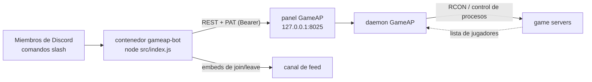

[English](README.md) · **Español**

# GameAP Discord bot

Controla los game servers de un panel [GameAP](https://docs.gameap.com/) desde Discord: encender,
apagar y reiniciar, ejecutar comandos RCON, y recibir un aviso en un canal cada vez que entra o sale
un jugador.


[](https://github.com/neyzerth/gameap-discord/actions/workflows/docker.yml)

- **Comandos slash** — `/servers`, `/status`, `/start`, `/stop`, `/restart`, `/players`, `/rcon`,
  `/feed`, `/autostop`, `/help`, `/language`.
- **RCON a través del panel** — el bot solo habla la API HTTP del panel, así que nunca abre un puerto
  de juego y el firewall puede seguir cerrado.
- **Feed de jugadores** — un sondeo anuncia entradas y salidas en el canal que elijas, con reglas que
  evitan avisos falsos.
- **Un bot, varios servidores** — varios guilds de Discord con sus propios canales, roles operadores y
  game servers visibles, todo configurado en JSON.

## Cómo funciona



El daemon ejecuta el RCON en el host del propio game server, por eso el bot nunca necesita abrir los
puertos de juego.

## Inicio rápido

Necesitas Docker + Compose, Node 22+ en el host (solo para `npm run deploy` y `npm test`), un panel
GameAP alcanzable desde el host, un PAT del panel y una aplicación de Discord con su bot token.

```bash
git clone https://github.com/neyzerth/gameap-discord.git && cd gameap-discord

cp .env.example .env && chmod 600 .env                # rellenar DISCORD_TOKEN y GAMEAP_TOKEN
cp config/servers.example.json config/servers.json    # y editar alias, labels e ids del panel
cp config/guilds.example.json  config/guilds.json     # guilds, canal de feed, roles operadores

npm install
npm run deploy                                        # registra los comandos slash (globales)
docker compose pull && docker compose up -d           # la imagen publicada
docker logs -f gameap-bot                             # "logged in as ... — N guild(s)"
```

Registra los comandos **una sola vez y de forma global**: tenerlos globales *y* por guild hace que
Discord los muestre duplicados en algunos clientes. En git solo están las plantillas
`*.example.json`; tus `config/*.json` reales y el `.env` son locales.

## Comandos

| Comando | Qué hace |
|---|---|
| `/servers` | Lista los game servers con su estado |
| `/status <server>` | Detalle: estado, jugadores, soporte RCON |
| `/start <server>` | Enciende (embed de progreso hasta que queda online) |
| `/stop <server>` | Apaga (pide confirmación con botones si hay jugadores) |
| `/restart <server>` | Reinicia (misma confirmación) |
| `/players <server>` | Jugadores en línea ahora |
| `/rcon <server> <command>` | Comando RCON crudo (`say hola`, `whitelist list`) |
| `/feed <server> on\|off` | Suscribe este canal a los avisos de entradas/salidas |
| `/autostop <server> [hours] [warn]` | Apaga el servidor solo si nadie juega N horas (por defecto 2 h; `hours:0` lo desactiva) |
| `/help [command]` | Guía general, o detalle y ejemplos de un comando |
| `/language [locale]` | Muestra el idioma de este guild o cámbialo (`en`, `es-MX`; `auto` vuelve a la config) |

`<server>` acepta el id del panel o el alias de `config/servers.json` (ej. `/start mc-survival`).
`/help` se genera desde los comandos que el bot cargó de verdad, y un test falla si un comando nuevo
llega sin texto de ayuda.

## Idiomas

El bot trae **inglés** como idioma base y **español mexicano** (`es-MX`). El idioma es **por
guild**: `/language` guarda un override en `data/locale.json`, con fallback a la entrada del guild
en `guilds.json`, los `defaults`, `DEFAULT_LOCALE` y finalmente inglés; `/language locale:auto`
borra el override. Agregar un idioma es un catálogo JSON más un deploy — ver
[docs/es/i18n.md](docs/es/i18n.md).

## Documentación

La documentación completa está en [`docs/`](docs/README.md) (inglés, la fuente de verdad) y su espejo
en [`docs/es/`](docs/es/README.md) (este idioma).

| Documento | Léelo si quieres saber… |
|---|---|
| [architecture.md](docs/es/architecture.md) | Cómo se conectan las piezas y por qué cada decisión de diseño |
| [commands.md](docs/es/commands.md) | Los 11 comandos y sus errores |
| [configuration.md](docs/es/configuration.md) | `.env`, los JSON y la precedencia del feed |
| [feed.md](docs/es/feed.md) | El watcher y sus reglas anti-spam |
| [autostop.md](docs/es/autostop.md) | Auto-apagado por inactividad (`/autostop`) y modo dry-run |
| [gameap-api.md](docs/es/gameap-api.md) | Endpoints del panel y abilities del PAT |
| [operations.md](docs/es/operations.md) | Desplegar, rotar credenciales, troubleshooting |
| [development.md](docs/es/development.md) | Mapa del código, tests, cómo añadir un comando |
| [i18n.md](docs/es/i18n.md) | Catálogos de idiomas, resolución del idioma por guild, cómo agregar uno |

```bash
npm test            # tests unitarios
npm run check:docs  # docs: paridad de idiomas, enlaces, anclas
```

## Licencia

MIT — ver [LICENSE](LICENSE).
