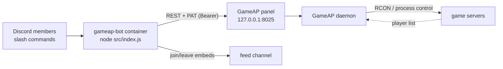

**English** · [Español](README.es.md)

# GameAP Discord bot

Control the game servers of a [GameAP](https://docs.gameap.com/) panel from Discord: start, stop and
restart them, run RCON commands, and get a message in a channel every time a player joins or leaves.


[](https://github.com/neyzerth/gameap-discord/actions/workflows/docker.yml)

- **Slash commands** — `/servers`, `/status`, `/start`, `/stop`, `/restart`, `/players`, `/rcon`,
  `/feed`, `/autostop`, `/help`, `/language`.
- **RCON through the panel** — the bot only speaks the panel's HTTP API, so it never opens a game
  port and the firewall can stay closed.
- **Player feed** — a poller announces joins and leaves in the channel you choose, with rules that
  keep false announcements out.
- **One bot, many servers** — several Discord guilds with their own channels, **per-command** operator
  roles and visible game servers, all configured in JSON.

## How it works



The daemon runs the RCON on the game server's own host, so the bot never needs the game ports open.

## Quick start

You need Docker + Compose, Node 22+ on the host (only for `npm run deploy` and `npm test`), a GameAP
panel reachable from the host, a panel PAT, and a Discord application with its bot token.

```bash
git clone https://github.com/neyzerth/gameap-discord.git && cd gameap-discord

cp .env.example .env && chmod 600 .env                # fill in DISCORD_TOKEN and GAMEAP_TOKEN
cp config/servers.example.json config/servers.json    # then edit aliases, labels and panel ids
cp config/guilds.example.json  config/guilds.json     # guilds, feed channel, operator roles

npm install
npm run deploy                                        # register the slash commands (global)
npm run sync:permissions                              # grant each guild its roles
docker compose pull && docker compose up -d           # the published image
docker logs -f gameap-bot                             # "logged in as ... — N guild(s)"
```

Register the commands **once, globally**: having them global *and* per guild makes Discord show them
twice in some clients. Only the `*.example.json` templates are in git — your real `config/*.json` and
`.env` stay local.

## Commands

| Command | What it does |
|---|---|
| `/servers` | List the game servers and their state |
| `/status <server>` | Details: state, players, RCON support |
| `/start <server>` | Power it on (progress embed until it is online) |
| `/stop <server>` | Power it off (asks for confirmation with buttons when players are online) |
| `/restart <server>` | Restart it (same confirmation) |
| `/players <server>` | Players online right now |
| `/rcon <server> <command>` | Raw RCON command (`say hi`, `whitelist list`) |
| `/feed <server> on\|off` | Subscribe this channel to the join/leave announcements |
| `/autostop <server> [hours] [warn]` | Shut the server down on its own after N hours with nobody playing (2 h by default; `hours:0` disables it) |
| `/help [command]` | Overview, or details and examples for one command |
| `/language [locale]` | Show this guild's language or change it (`en`, `es-MX`; `auto` goes back to the config) |

`<server>` accepts the panel id or the alias from `config/servers.json` (e.g. `/start mc-survival`).
`/help` is generated from the commands the bot actually loaded, and a test fails if a command ships
without help text.

## Languages

The bot ships with **English** as its base language and **Mexican Spanish** (`es-MX`). The language
is **per guild**: `/language` stores an override in `data/locale.json`, falling back to the guild's
`guilds.json` entry, `defaults`, `DEFAULT_LOCALE` and finally English; `/language locale:auto`
clears the override. Adding a language is a JSON catalog plus a deploy — see
[docs/i18n.md](docs/i18n.md).

## Documentation

Full docs live in [`docs/`](docs/README.md) (English, the source of truth) and are mirrored in
[`docs/es/`](docs/es/README.md).

| Document | Read it to learn… |
|---|---|
| [architecture.md](docs/architecture.md) | How the pieces connect and why each decision was made |
| [commands.md](docs/commands.md) | The 11 commands and their errors |
| [configuration.md](docs/configuration.md) | `.env`, the JSON files and the feed precedence |
| [feed.md](docs/feed.md) | The watcher and its anti-spam rules |
| [autostop.md](docs/autostop.md) | Idle auto-shutdown (`/autostop`) and dry-run mode |
| [gameap-api.md](docs/gameap-api.md) | Panel endpoints and PAT abilities |
| [operations.md](docs/operations.md) | Deploy, rotate credentials, troubleshooting |
| [development.md](docs/development.md) | Code map, tests, adding a command |
| [i18n.md](docs/i18n.md) | Locale catalogs, per-guild language resolution, adding a language |

```bash
npm test            # unit tests
npm run check:docs  # docs: language parity, links, anchors
```

## License

MIT — see [LICENSE](LICENSE).
