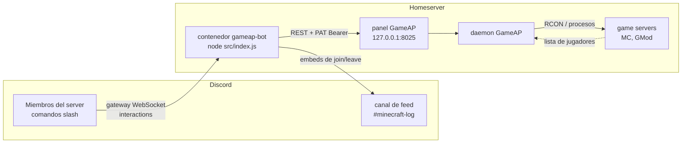

# Documentación — GameAP Discord bot

Bot de Discord que controla los game servers del panel **GameAP** y avisa en un canal aparte
cuándo entra y cuándo sale cada jugador. Vive en `/opt/dockge/stacks/gameap-bot` y corre en
Docker como parte del stack de Dockge.

> Todos los diagramas están en **Mermaid**. Se renderizan en GitHub/GitLab/Forgejo, en VS Code
> (extensión Markdown Preview Mermaid) y en Obsidian. Discord **no** los renderiza: son docs de repo.

## Cómo funciona en 30 segundos

1. El bot se conecta a Discord con el **gateway** (WebSocket) y expone comandos slash.
2. Cada comando habla con la **API HTTP del panel GameAP** usando un **PAT** (API key).
3. El panel le pide al **daemon** que ejecute las acciones y el RCON; el bot **nunca** abre
   puertos de juego ni habla RCON directo.
4. Un **watcher** consulta cada ~20 s la lista de jugadores de los servidores con `announce: true`
   y, cuando detecta cambios, publica un embed en los canales suscritos (uno por guild/canal).



## Índice

| Documento | Léelo si quieres saber… |
|---|---|
| [architecture.md](architecture.md) | Cómo se conectan las piezas, flujo de un comando y del watcher, y **por qué** cada decisión de diseño |
| [commands.md](commands.md) | Los 10 comandos: opciones, permisos, qué embed devuelven y qué errores pueden dar |
| [configuration.md](configuration.md) | Variables de entorno y los JSON de config/estado, con la precedencia exacta del feed |
| [feed.md](feed.md) | Cómo detecta el watcher las entradas/salidas y cómo evita avisos falsos |
| [autostop.md](autostop.md) | El auto-apagado por inactividad (2 h sin jugadores), cómo configurarlo y cómo probarlo |
| [gameap-api.md](gameap-api.md) | Endpoints del panel que usa el bot, permisos del PAT y manejo de errores |
| [operations.md](operations.md) | Desplegar, actualizar, rotar credenciales, troubleshooting paso a paso |
| [development.md](development.md) | Mapa del código, cómo agregar un comando, cómo correr los tests |

## Modelo de datos (config vs estado)

`data/state.json` — estado en disco del watcher: qué jugadores vio en el último ciclo y el reloj de
inactividad de cada servidor.

```json
{
  "servers": {
    "8": {
      "players": ["neyzer", "amigo"], "initialized": true, "unknown": false,
      "idle": { "idleMs": 3600000, "idleSince": 1759170000000, "warnedAt": null, "blindMs": 0, "autoStoppedAt": null },
      "lastControlAt": 1759160000000
    }
  },
  "feeds": {
    "1408342037538799616:8": { "initialized": true }
  }
}
```

`data/autostop.json` — overrides de `/autostop` (por servidor, no por Discord).

```json
{ "8": { "hours": 2, "warnMinutes": 15 } }
```

`data/feeds.json` — overrides de `/feed` (no se toca la config versionada).

```json
{
  "1408342037538799616:8": { "on": true, "channelId": "1554590063541620897" }
}
```

## Glosario

| Término | Qué es aquí |
|---|---|
| **panel** | La web/API de GameAP (`:8025`). Es el único punto al que el bot habla. |
| **daemon** | Proceso de GameAP que arranca/apaga servidores y ejecuta RCON. |
| **PAT** | Personal Access Token del panel. Va en `Authorization: Bearer <PAT>`. |
| **guild** | Un servidor de Discord (no confundir con "game server"). En la config aparece como `guilds`. |
| **feed** | Canal suscrito a los avisos de entradas/salidas de un game server. |
| **baseline** | Marcado silencioso: la primera lectura de un servidor (o de una suscripción nueva) no genera avisos. |
