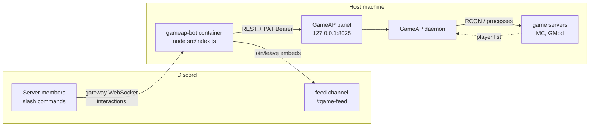

**English** · [Español](es/README.md)

# Documentation — GameAP Discord bot

Discord bot that controls the game servers of a **GameAP** panel and posts a message in a separate
channel whenever a player joins or leaves.

This English tree is the **source of truth**. A Spanish mirror of every document lives in
[`docs/es/`](es/README.md); if the two ever disagree, the English one wins.

> Every diagram is **Mermaid**. They render on GitHub/GitLab/Forgejo, in VS Code (Markdown Preview
> Mermaid extension) and in Obsidian. Discord does **not** render them: these are repo docs.

## How it works in 30 seconds

1. The bot connects to Discord over the **gateway** (WebSocket) and exposes slash commands.
2. Every command talks to the **GameAP panel HTTP API** using a **PAT** (API key).
3. The panel asks its **daemon** to run the actions and the RCON; the bot **never** opens game
   ports or speaks RCON directly.
4. A **watcher** polls the player list of every server with `announce: true` roughly every 20 s and,
   when it detects a change, publishes an embed in the subscribed channels (one per guild/channel).



## Index

| Document | Read it to learn… |
|---|---|
| [architecture.md](architecture.md) | How the pieces connect, the flow of a command and of the watcher, and **why** each design decision was made |
| [commands.md](commands.md) | The 11 commands: options, permissions, which embed they return and which errors they can raise |
| [custom-commands.md](custom-commands.md) | Extra per-guild commands defined in config/commands.json, one RCON command each |
| [configuration.md](configuration.md) | Environment variables and the config/state JSON files, with the exact feed precedence |
| [feed.md](feed.md) | How the watcher detects joins/leaves and how it avoids false announcements |
| [autostop.md](autostop.md) | The idle auto-stop (2 h with no players), how to configure it and how to test it safely |
| [power.md](power.md) | Optional: in-game and Discord warnings when the UPS goes on battery, and the low-battery shutdown |
| [gameap-api.md](gameap-api.md) | Panel endpoints the bot uses, the PAT abilities it needs and its error handling |
| [operations.md](operations.md) | Deploy, update, rotate credentials, step-by-step troubleshooting |
| [development.md](development.md) | Code map, how to add a command, how to run the tests |
| [i18n.md](i18n.md) | Locale catalogs, per-guild language resolution, how to add a language |

## Data model (config vs state)

`data/state.json` — the watcher's on-disk state: which players it saw in the last cycle, plus the
idle clock of each server.

```json
{
  "servers": {
    "8": {
      "players": ["alice", "bob"], "initialized": true, "unknown": false,
      "idle": { "idleMs": 3600000, "idleSince": 1759170000000, "warnedAt": null, "blindMs": 0, "autoStoppedAt": null },
      "lastControlAt": 1759160000000
    }
  },
  "feeds": {
    "123456789012345678:8": { "initialized": true }
  }
}
```

`data/autostop.json` — `/autostop` overrides (per server, not per Discord guild).

```json
{ "8": { "hours": 2, "warnMinutes": 15 } }
```

`data/feeds.json` — `/feed` overrides (the committed config is never modified).

```json
{
  "123456789012345678:8": { "on": true, "channelId": "234567890123456789" }
}
```

## Glossary

| Term | What it means here |
|---|---|
| **panel** | The GameAP web UI and API (`:8025`). The only thing the bot talks to. |
| **daemon** | The GameAP process that starts/stops servers and runs RCON. |
| **PAT** | Personal access token of the panel, sent as `Authorization: Bearer <PAT>`. |
| **guild** | A Discord server (not to be confused with "game server"). It shows up as `guilds` in the config. |
| **feed** | A channel subscribed to the join/leave announcements of one game server. |
| **baseline** | Silent marking: the first read of a server (or of a new subscription) produces no announcements. |

## Keeping both languages in sync

`npm run check:docs` verifies that every document has a counterpart in the other language, that all
relative links and anchors resolve, that each file starts with the right language switcher, that both
trees stay structurally parallel (headings, tables, diagrams) and that no internal detail leaked into
the public repo. Run it after touching any doc.

The leak check compares every doc, the root READMEs, the config templates and `src/` against the
patterns in **`.docs-leaks`** — a gitignored, machine-specific file, one regular expression per line,
with the format and examples in `.docs-leaks.example`. It is the one file that must never be
committed, because the patterns *are* the secret. Without it the check is skipped and reported as
skipped.
