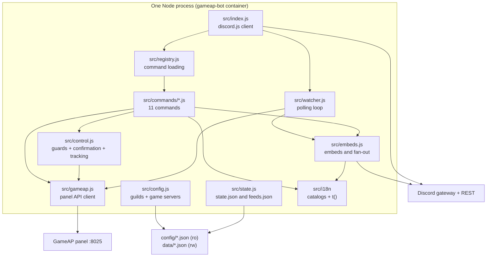
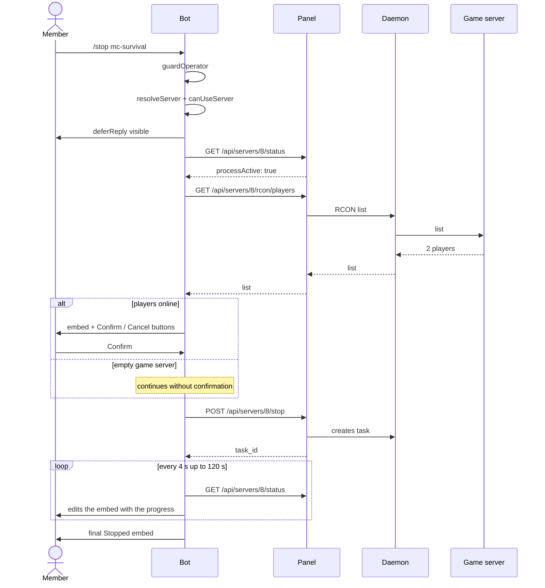
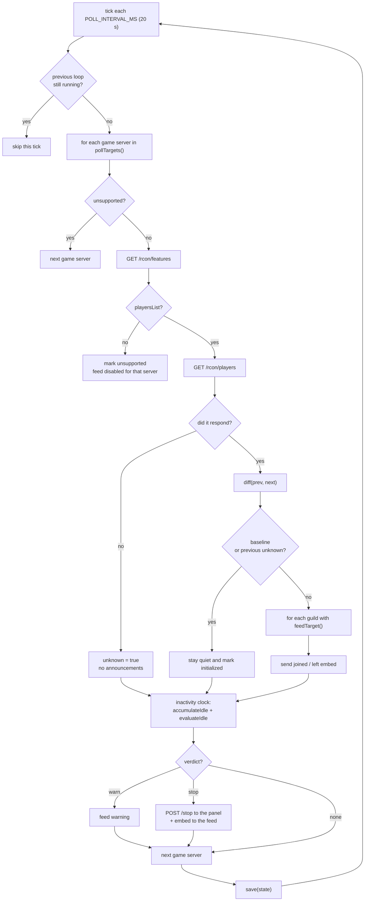

**English** · [Español](es/architecture.md)

# Architecture

## Pieces

Responsibilities, one line each:

| File | Responsibility |
|---|---|
| `src/index.js` | Login, command loading, interaction router, watcher startup, `guildCreate` |
| `src/registry.js` | Single source of the command list (used by the bot, the deploy and `/help`) and of `GATED_COMMANDS` |
| `src/commands/*.js` | One command per file: `data` (definition), `help`, `execute`, optional `autocomplete` |
| `src/commands/language.js` | `/language`: shows or overrides this guild's locale (`data/locale.json`; `auto` clears it), operators only |
| `src/control.js` | Shared `/start`, `/stop`, `/restart` logic: guard, game server resolution, confirmation, tracking |
| `src/permissions.js` | `isOperator(member, command)`: the Administrator flag (unless `adminBypass: false`), then the guild's `commandRoles` for that command, then `operatorRoleIds`, then everyone |
| `src/command-permissions.js` | **Pure** Discord-side visibility: the permission overwrites a guild gets for a gated command |
| `src/config.js` | Multi-guild resolution: aliases, visible game servers, feed channel, runtime overrides |
| `src/gameap.js` | HTTP panel client (15 s timeout, errors carry `status`) |
| `src/watcher.js` | Player polling loop, announce-or-stay-quiet decision, and the inactivity clock (auto-stop) |
| `src/autostop.js` | **Pure** auto-stop logic: resolve config, accumulate inactivity, evaluate warn/stop |
| `src/state.js` | Disk persistence and a pure `diff()` between two player lists |
| `src/embeds.js` | Embed construction and delivery to the feed channels |
| `src/i18n/` | Locale catalogs (`locales/*.json`) and the translation API: `t()`, `plural()`, per-guild resolution, Discord localizations |
| `src/help.js` | General and per-command help, generated from the live commands |
| `src/logger.js` | Log with levels (`LOG_LEVEL`), no secrets |
| `src/check-permissions.js` | **Read-only** audit of the per-guild grants against the config (`npm run check:permissions`). Discord refuses those writes from a bot, so a guild admin grants them in the client; `src/deploy-commands.js` registers the gated commands hidden (`src/discord-app.js` resolves the app id) |

All user-facing text is localized and the language is **per Discord guild**: the `/language`
override (`data/locale.json`) wins, then the guild's entry in `guilds.json`, then `defaults`, then
`DEFAULT_LOCALE`, then English. Embeds are built with the locale of the guild they are sent to, so
the feed fan-out speaks each Discord's language — never one global config.

## Control command flow (`/stop`)

If the panel does not respond in time, the final embed says *"Still working — open the GameAP panel to
watch the console"* and the task keeps running in the daemon: the bot cancels nothing.

## Watcher cycle

## Design decisions and rationale

| Decision | Why | Discarded alternative |
|---|---|---|
| **Node 22 + discord.js** | The bot is REST + embeds; Node was already on the host and the other projects on the host are Node too | Python: would force pure async and adds nothing here (only worth it if local AI is ever added) |
| **No GameAP webhooks** | GameAP v4 has **no** webhooks: the WASM plugin events cover start/stop/restart, daemon tasks and users, but **not** player joins/leaves | Waiting for a player webhook: it does not exist |
| **RCON via the panel** | The panel/daemon runs the RCON, so the bot never needs to touch the game ports or open UFW | Direct RCON from the container: would require exposing 5500-5599 and per-game RCON handling |
| **`network_mode: host`** | UFW blocks container → host; with host networking it reaches `127.0.0.1:8025` with no extra rules | Bridge network: broke communication with the panel (the same problem panel→daemon had) |
| **`user: "1000:1000"`** | The host user is 1000; this keeps `./data` from ending up root-owned | Running as root: left files the user could not edit |
| **Global commands (single source)** | They work in any guild where the bot is present and avoid the global+guild pair Discord shows duplicated | Per-guild registration: instant but duplicated when both coexist |
| **Config in JSON, not a database** | Adding a guild/channel is editing a file: no migrations, no UI. `data/` stores the mutable stuff | SQLite/Postgres: unjustified complexity for 2 guilds and 5 game servers |
| **Subscription fan-out** | One polling loop per game server, and the announcement replicates to all subscribed guilds/channels: N channels do not multiply panel calls | One loop per channel: N times more load on the panel |
| **State on disk (baseline + unknown)** | Avoids the "everyone left" spam when the game server is down or the bot restarts | In-memory state: every restart would announce a false "everyone left" |
| **Auto-stop in the same polling loop** | The inactivity clock needs exactly the data the watcher already fetches (0 players = inactivity); no cron, no new processes, and the timing logic lives isolated and testable in `src/autostop.js` | A separate cron/scheduled task: would duplicate the polling and could not tell "0 players" from "couldn't query" |

## Error handling and concurrency

- Every panel call has a **15 s timeout** (`AbortSignal.timeout`); the errors carry `.status`.
- The watcher uses a **`busy`** flag: if a loop takes longer than `POLL_INTERVAL_MS`, the next tick is skipped (they never overlap).
- An error on one game server does **not** abort the loop for the others.
- `/start`, `/stop` and `/restart` cap the tracking at **120 s**; afterwards the embed warns and the user checks the panel.
- The **read** commands (`/servers`, `/status`, `/players`) reply with a descriptive embed when the game server is down or the game cannot list players, instead of an error stack.

## Known limitations

- If there are **two Minecraft game servers** up at the same time, the second one does not start (a host limitation, not the bot's).
- The bot needs **View Channel**, **Send Messages**, **Embed Links** and **Read Message History** in the feed channel; it does not ask for or use Administrator.
- Without `announce: true` in `config/servers.json`, a game server is not polled (it does not appear in the feed).
  With `autoStop` it is polled even without a feed.
- New-guild channel discovery is logged on joining (`joined guild …`), but the config is **not** hot-reloaded: changes to `config/guilds.json` require a container restart.