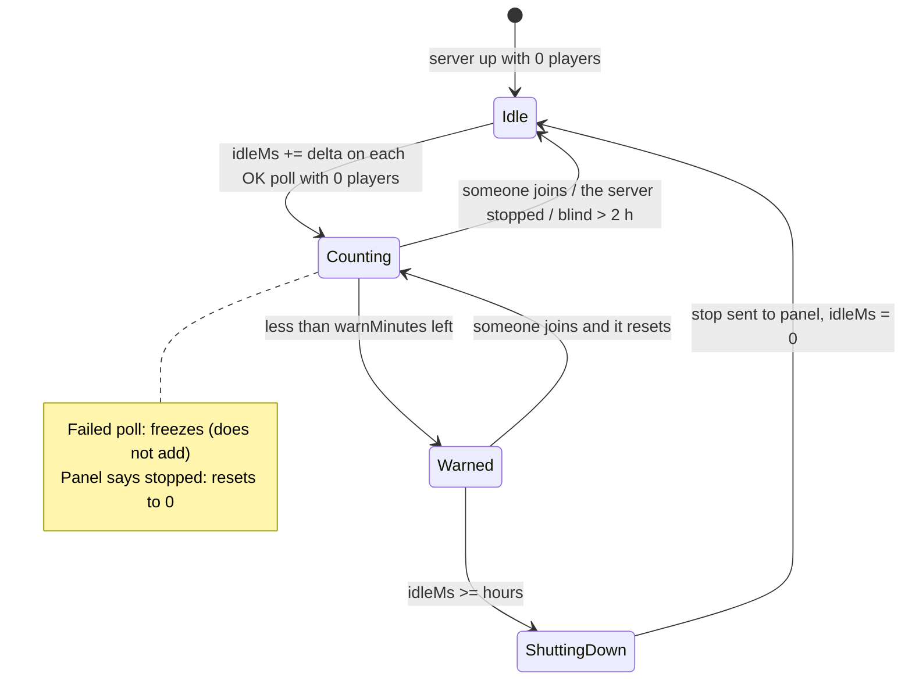
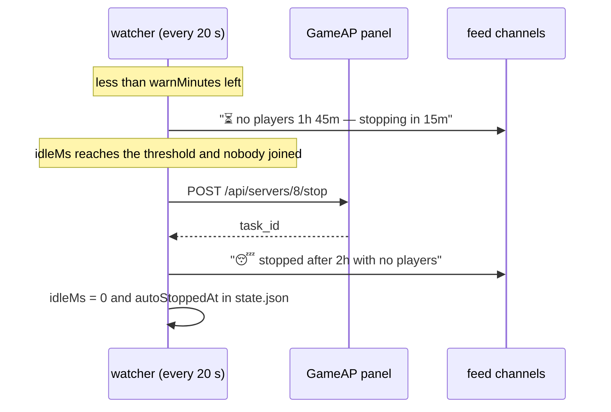

**English** · [Español](es/autostop.md)

# Idle auto-stop (`/autostop`)

If nobody plays for **X hours**, the bot stops the game server on its own and announces it in the feed. Everything
is configured from Discord, without touching files.

> Current default: **2 h** with a **15 min** prior warning, only for **MC Survival** (`config/servers.json`).
> The rest of the servers stay disabled until you enable them.

## How it works

The idle clock is fed by the **same polling loop** that detects joins and leaves
(every `POLL_INTERVAL_MS`, 20 s). No cron and no new process: once per cycle and per server
time accumulates, a decision is made and, if it is due, a `POST /api/servers/{id}/stop` is sent to the panel.





## Exact rules

| Situation | What the clock does |
|---|---|
| Poll OK and **0 players** | **Adds** the time since the previous poll |
| Poll OK and **≥1 player** | **Resets** to 0 (and allows a new warning next time) |
| Poll failed and the panel says **stopped** (`processActive: false`) | **Resets** to 0: a stopped game server does not accumulate credit |
| Poll failed but the panel reports it active (RCON broken, starting up) | **Freezes**: does not add. If it stays blind **> 2 h**, resets to 0 |
| `/start`, `/stop` or `/restart` just used | **10 min grace**: does not trigger anything |
| The game cannot list players | The clock **does not apply** (warned once in the logs) |

When it stops, the cycle ends: `idleMs` goes back to 0 and `autoStoppedAt` is saved. If the `stop`
fails (panel down), it is logged and **not** retried in a loop — the cycle must mature again.

## Configuration

### From Discord (recommended)

| Command | Effect |
|---|---|
| `/autostop mc-survival` | Shows the state: active setting, where it comes from, accumulated idle time, how much is left and in which channel it will warn |
| `/autostop mc-survival hours:2` | Enables/adjusts the threshold (numeric id also accepted) |
| `/autostop mc-survival hours:2 warn:0` | Same, but **without** a prior warning message |
| `/autostop mc-survival hours:0` | **Disables** the auto-stop |

- Only **operators** (with `operatorRoleIds: []` = everyone, like the rest of the bot; `commandRoles.autostop` can give it its own roles; the Administrator flag always passes unless `adminBypass: false`).
- The setting is saved in `data/autostop.json` and applies **immediately**, without restarting the bot.
- Limits: `hours` 0-168, `warn` 0-120.

### By file

`config/servers.json` (versioned default; the Discord override has priority):

```json
"8": {
  "alias": "mc-survival",
  "label": "MC Survival",
  "emoji": "🎲",
  "announce": true,
  "autoStop": { "hours": 2, "warnMinutes": 15 }
}
```

`data/autostop.json` (written by `/autostop`; key = server id, **not** per Discord — there is one
server, and two guilds with different thresholds would overwrite each other):

```json
{ "8": { "hours": 2, "warnMinutes": 15 } }
```

Precedence: **Discord override → `config/servers.json` → disabled**. `/autostop … hours:0`
deletes the override key; if the config still enables auto-stop, it applies again.

### Safe mode (`AUTOSTOP_DRY_RUN`)

```bash
echo 'AUTOSTOP_DRY_RUN=true' >> .env && docker compose up -d     # logs and announces, does not stop
echo 'AUTOSTOP_DRY_RUN=false' >> .env && docker compose up -d    # back to normal
```

With `true`, the watcher logs `[dry-run] would stop server 8 (idle 2h 00m)` and posts the embed with
the footer *DRY RUN — nothing was stopped*. Useful to check the whole chain without stopping anything.

## Feed announcements

They go to **all** channels subscribed to the server (the same ones as `/feed`):

- Prior warning (if `warnMinutes > 0`):
  `⏳ No players for **1h 45m** — stopping in **15m** unless someone joins.`
  footer: `Auto-stop after 2h idle · /autostop mc-survival hours:0 to disable`
- Stopped: `😴 Stopped after **2h 00m** with no players.` · footer: `Start it again with /start mc-survival`

If **no** channel is subscribed, the stop happens anyway and only stays in the logs.

## State in `data/state.json`

```json
"8": {
  "players": [], "initialized": true, "unknown": false,
  "idle": { "idleMs": 3600000, "idleSince": 1759170000000, "warnedAt": null, "blindMs": 0, "autoStoppedAt": null },
  "lastControlAt": 1759160000000,
  "lastAutoStop": { "at": 1759150000000, "idleMs": 7200000 }
}
```

- `idleMs`: accumulated time with no players (what decides the stop).
- `idleSince`: when it started counting (to display it).
- `warnedAt`: marker of the warning already sent in this cycle (avoids repeating it every 20 s).
- `lastControlAt`: last `/start`/`/stop`/`/restart` (grace).
- `lastAutoStop`: last automatic stop.

Deleting `idle` for a server is safe: the clock starts from zero on the next poll.

## Common problems

| Symptom | Likely cause | What to check |
|---|---|---|
| It never stops | `hours: 0`, or the clock keeps resetting because of failed polls | `/autostop <server>` (shows `Idle now`), `docker logs` with `LOG_LEVEL=debug` |
| It stops too early | Another guild/server sharing the config (it is **per server**) or the clock was already accumulated | `/autostop <server>`: look at `Setting from` and `Idle now` |
| The prior warning does not arrive | `warn: 0`, or the channel is not subscribed | `/feed <server> on` in the channel; `/autostop <server>` shows the channel that will be warned |
| It warns but does not stop | The `stop` failed (panel/daemon) | `docker logs \| grep auto-stop` |
| Not in the feed even though it stops | No channel subscribed | `/feed <server> on` |
| `does not support listing players` | The game cannot list players via RCON | Auto-stop cannot work on that server |

## How to test it without risk

1. **Dry-run** with the clock forced (see above and `docs/development.md`): it announces without stopping.
2. **Real warning**: keep the threshold at 2 h and wait for the 1h45m mark — it stops nothing.
3. **Real stop**: `/autostop <free-server> hours:1` and don't join for an hour. With Minecraft
   on this host, remember that two MC servers cannot be on at the same time.