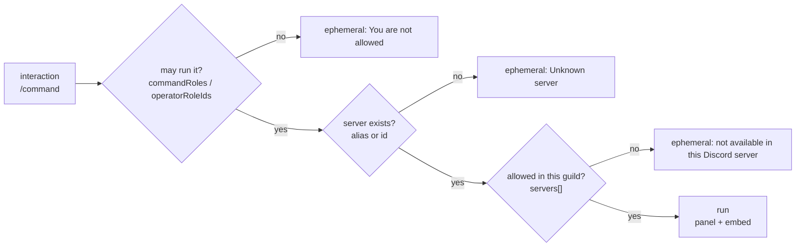
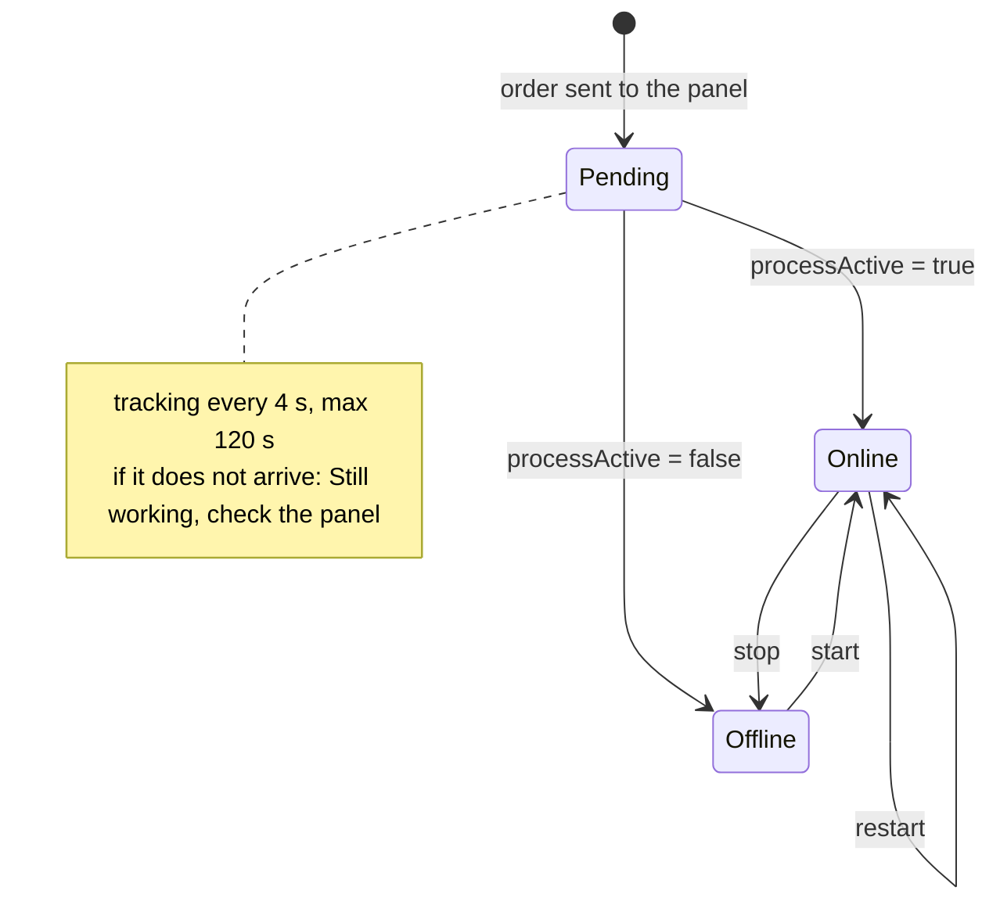

**English** · [Español](es/commands.md)

# Commands

The 11 commands are registered **globally** (a single source, see
[architecture.md](architecture.md#design-decisions-and-rationale)) and work in any
guild where the bot is present. All declare `setContexts(Guild)`: they do not work over DM.



## Summary

| Command | Options | Who? | Reply | Under the hood |
|---|---|---|---|---|
| `/servers` | — | everyone | public | `GET /api/servers` |
| `/status <server>` | server | everyone | public | `GET /status` + `/rcon/features` + `/rcon/players` |
| `/players <server>` | server | everyone | public | `GET /status` + `/rcon/players` |
| `/start <server>` | server | operators | public (progress) | `POST /start` |
| `/stop <server>` | server | operators | public (confirmation) | `POST /stop` |
| `/restart <server>` | server | operators | public (confirmation) | `POST /restart` |
| `/rcon <server> <command>` | server, command | operators | public | `POST /rcon` |
| `/feed <server> <state>` | server, on\|off | operators | public | local state (`data/feeds.json`) |
| `/autostop <server> [hours] [warn]` | server, hours, warn | operators | public | local state (`data/autostop.json`) + `POST /stop` when it is time |
| `/language [locale]` | locale | operators | public | local state (`data/locale.json`) |
| `/help [command]` | command | everyone | public | commands loaded in memory |

`<server>` accepts the panel **id** (`8`) or the **alias** from `config/servers.json`
(`mc-survival`); the comparison ignores case. On commands with `autocomplete`, the dropdown
only offers the game servers **visible in that guild**.

Practical difference: **the info commands require no permission** (anyone in the Discord
server can look), while the control/server ones do go through `guardOperator()` — with the
command name, so each of them can have its own roles.

## Who can run what

The gated commands call `guardOperator(interaction, interaction.commandName)`, and
`src/permissions.js` resolves the roles **for that command**:

1. `commandRoles.<command>` of the guild (non-empty) → only those roles.
2. `operatorRoleIds` of the guild (non-empty) → only those roles.
3. neither → **everyone** (the current setup: trusted friends).

An empty list means "not set" and inherits the next level, so `"rcon": []` is **not** "everyone".
`commandRoles.<command>` **replaces** the operator list for that command (it is not intersected
with it): a guild can let moderators `/start` and `/stop` while keeping `/rcon` for admins only.
The lists do **not** accumulate, so list every command that group needs — anything not listed falls
back to `operatorRoleIds`.

```json
"commandRoles": { "start": ["<mod role id>"], "stop": ["<mod role id>"], "rcon": ["<admin role id>"] }
```

A member holding Discord's **Administrator** flag passes every check (useful for the server owner).
`"adminBypass": false` in that guild makes the roles mandatory again, admins included.

In the client the gated commands are only **shown** to members who can run them: they are registered
hidden (`default_member_permissions: "0"`) and `npm run sync:permissions` gives each guild the roles
of its config. Details and the sync step: [operations.md](operations.md#visibility-default-permissions-plus-overwrites).

Field reference, inheritance from `defaults` and a complete example:
[configuration.md](configuration.md#configguildsjson).

## Information

### `/servers`

Lists all the game servers **visible in that guild** with their status.

- 🟢 `online` · ⚪ `offline` · ❓ no answer from the panel.
- Shows the alias/label from `servers.json` (not the raw panel name), id, game and IP:port.
- A game server "down" in the panel is marked offline; a disabled one may not answer and shows ❓.

### `/status <server>`

One game server in detail: status, player count, who is online and whether RCON is
configured. It queries the player list **only if** the game server is active and the game
supports listing players, which is why it works the same with Minecraft and with GMod.

Implementation detail: if `features.rcon === false`, the embed carries the footer
*"RCON is not configured for this server"*.

### `/players <server>`

Player list over RCON. It replies with a clear message instead of an error when:

| Situation | What you will see |
|---|---|
| Game server stopped | `RCON unavailable: the server is stopped.` |
| The game does not support listing players | `This game does not support listing players over RCON.` |
| RCON failed (daemon down, port, etc.) | `RCON error: <status> <message>` |

## Control

`/start`, `/stop` and `/restart` share `runControl()` in `src/control.js`:

1. **Operator guard** → otherwise an ephemeral reply *"You are not allowed to use this command."*
2. **Game server resolution** (alias/id + visibility in the guild).
3. `deferReply()` so the interaction is not lost (Discord's 3 s limit).
4. **Already-reached state shortcut**: `/start` on something already running says *"It was already running."*;
   `/stop` on something stopped says *"It was already stopped."* (no order is sent to the daemon).
5. **Button confirmation** (only `stop` and `restart`): if there are players, an orange embed showing
   the count and the player list (e.g. **`2` players are online:**, in the guild's language) with
   `Yes, stop` / `Cancel` buttons, 60 s wait, and **only the author** can press them.
   If nobody confirms (or time runs out) → *Cancelled*.
6. **Task submission** to the panel and **tracking** every 4 s up to 120 s, editing the embed with the
   elapsed time. The footer shows `Daemon task #<id>` when the panel returns it.



For `/restart` the bot considers the process finished when it **saw the game server go
down** and then come back: that way it does not mistake the recovery for the old state.

## `/rcon <server> <command>`

Passes your command through, verbatim, to the game server's RCON. It is powerful and
without validation (beyond rejecting line breaks and `;`), which is why it is operator-only — and
why it is the command that benefits the most from its own `commandRoles.rcon` (a smaller group
than the rest of the control commands).

- Examples: `/rcon mc-survival say Server restarts in 5 minutes`, `/rcon mc-survival list`,
  `/rcon mc-survival whitelist list`.
- The output goes in a code block and is cut at **1800 characters**.
- If the command produces no output: *"RCON command sent (no output)."*

## `/feed <server> on|off`

Subscribes **the channel where you run it** (not the whole Discord server) to the join/leave
feed of that game server. It stores the override in `data/feeds.json` and applies it in
memory without restarting.

- `on` → activates and points at the current channel.
- `off` → silences that game server in that guild.
- A new subscription starts **quiet**: the first notice arrives with the next real join/leave,
  not with the people already inside (see [feed.md](feed.md)).

## `/autostop <server> [hours] [warn]`

Stops the game server automatically when nobody plays for X hours. Full details in
[autostop.md](autostop.md).

- Without `hours` nor `warn` → shows the state (the active setting, where it comes from,
  accumulated inactivity, how much time is left and in which channel the warning will go out).
- `hours:2` activates/adjusts the threshold; `warn:10` changes the warning minutes; `warn:0` = no warning.
- `hours:0` disables it (removes the override and falls back to whatever `config/servers.json` says).
- It is **per game server**, not per Discord: the setting applies to every guild that sees that game server.
- Operators only.

## `/language`

Shows or changes the language the bot uses **in this Discord server** (per guild, not per
user). Operators only (`guardOperator()`).

- Without `locale` → shows the current effective language.
- `locale:en` / `locale:es-MX` → sets the guild override.
- `locale:auto` → deletes the override and goes back to the configured language.
- The `locale` parameter has **autocomplete** with the offered values: `en`, `es-MX`, `auto`.
- The override lives in `data/locale.json` (the same pattern as `/feed` and `/autostop`, so
  `config/guilds.json` is not touched) and applies in memory without restarting.

The effective language is resolved **once per guild**: `/language` override →
`config/guilds.json` for that guild → `config/guilds.json` defaults → `DEFAULT_LOCALE`
(environment) → English (bot base language). A value with no catalog entry is ignored, and a
regional variant (`es-AR`, `es-419`) is served by the catalog of its language (`es-MX`).

The reply embed shows:

| Field | Meaning |
|---|---|
| `Current` | The effective language right now |
| `Setting from` | Where it comes from: `/language` (Discord) \| `config/guilds.json` (this guild) \| `config/guilds.json` (defaults) \| `DEFAULT_LOCALE` (environment) \| bot base language |
| `Available` | The language labels the bot knows |

For example (in the language the guild is using):

```
Current:      es-MX
Setting from: /language (Discord)
Available:    en, es-MX
Footer:       Use `/language locale:es-MX` to change it, or `locale:auto` to go back to the configured language.
```

The language is **per guild**: every guild where the bot is present can have its own, and
everything the bot writes in Discord — embeds, notices, help, ephemeral errors, buttons —
follows that language; command names stay in English. Details in [i18n.md](i18n.md).

## `/help [command]`

- `/help` → general guide: the commands by category, the game servers available **in that guild**
  and how the feed works.
- `/help command:<name>` → a card with **Usage** (auto-generated from the options), **Options**,
  **Examples** and **Good to know** — the field names follow the guild's language (in Spanish:
  `Uso`, `Opciones`, `Ejemplos`, `Bueno saberlo`).
- The `command` parameter has **autocomplete** that filters the available names.

The help is not hand-written: `src/help.js` builds it from the commands loaded by
`src/registry.js`. To add a command, just export
`export const help = { examples: [...], notes: '...' }` and put it into a category of
`CATEGORIES`; if you forget, **the test** `src/help.test.js` **fails**.

## Errors any command can return

| Message | Cause |
|---|---|
| `You are not allowed to use this command.` | The guild restricts that command (`commandRoles[<command>]` or `operatorRoleIds`) and you hold none of those roles |
| `Unknown server: <value>` | The alias/id is not in `config/servers.json` |
| `That server is not available in this Discord server.` | The guild has `servers: [...]` and that id is not in the list |
| `Command failed: <message>` | Uncaught exception (added by the router in `index.js`), ephemeral |
| `RCON failed: <status> <message>` | The panel rejected/failed the RCON (e.g. game server stopped) |
| `Command rejected: line breaks and ";" are not allowed.` | `/rcon` with a line break or `;` |