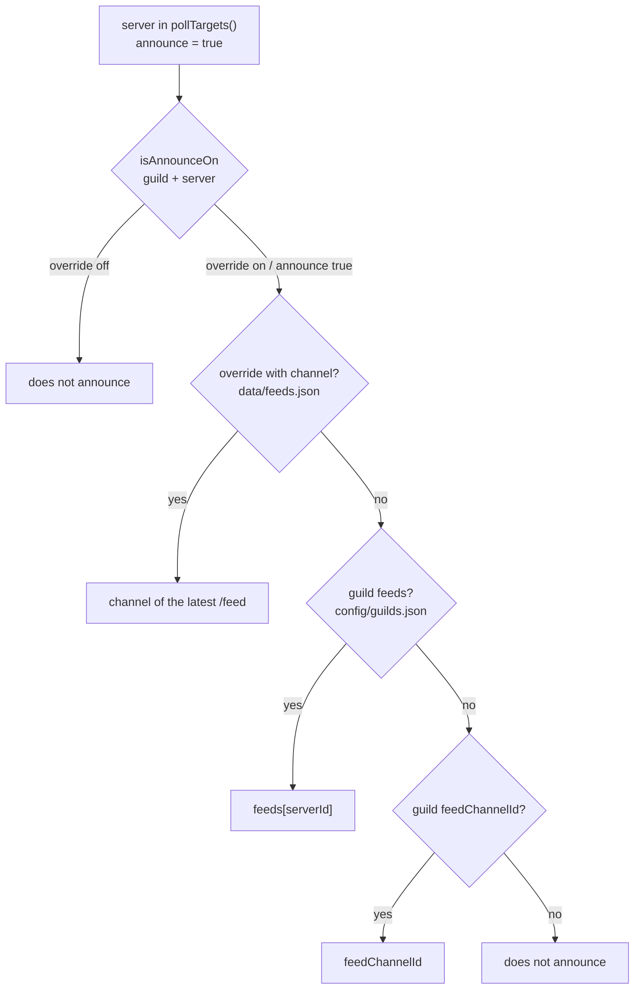

**English** · [Español](es/configuration.md)

# Configuration

Six JSON config/state files and a `.env`. Inside
`config/`, the repo only commits the **`*.example.json` templates**: the real `config/servers.json`
and `config/guilds.json` are local (they are listed in `.gitignore`) because they carry the ids of
your guilds, channels and game servers. The `data/*.json` files are **runtime state** and can be
deleted without losing configuration.

```
compose.yaml          container (host network, user 1000, mounts)
.env                  secrets: DISCORD_TOKEN, GAMEAP_TOKEN (chmod 600, never in the repo)
config/servers.json   game server catalog: alias, label, emoji, announce, autoStop
config/guilds.json    per Discord: feed channel, operator roles (per command), visible servers
data/state.json       watcher: known players, inactivity clock and subscriptions
data/feeds.json       /feed overrides (on/off and channel)
data/autostop.json    /autostop overrides (per server)
data/locale.json      /language overrides (per guild)
```

First time (or a fresh clone):

```bash
cp config/servers.example.json config/servers.json
cp config/guilds.example.json  config/guilds.json    # and edit the real alias/label/ids
```

## Environment variables

| Variable | Default | Purpose |
|---|---|---|
| `DISCORD_TOKEN` | — | Bot token (required) |
| `GAMEAP_TOKEN` | — | Panel PAT (required) |
| `GAMEAP_API_URL` | `http://127.0.0.1:8025` | Panel API base URL |
| `POLL_INTERVAL_MS` | `20000` | Watcher poll interval (20 s) |
| `LOG_LEVEL` | `info` | `debug`, `info`, `warn`, `error` |
| `DEFAULT_LOCALE` | `en` | Base language: `en` or `es-MX` (empty = `en`) |
| `AUTOSTOP_DRY_RUN` | `false` | `true` = auto-shutdown only logs and announces what it would do, **does not** shut down (note: it is read when the container is created; `docker compose up -d` is needed) |
| `AUTOSTOP_FILE` | `./data/autostop.json` | `/autostop` overrides |
| `SERVERS_FILE` | `./config/servers.json` | Catalog |
| `GUILDS_FILE` | `./config/guilds.json` | Per-guild config |
| `STATE_FILE` | `./data/state.json` | Watcher state |
| `FEEDS_STATE_FILE` | `./data/feeds.json` | `/feed` overrides |
| `LOCALES_STATE_FILE` | `./data/locale.json` | `/language` overrides |
| `DISCORD_APP_ID` | — | Informational only: `deploy-commands.js` resolves the id from the token |

`DISCORD_GUILD_ID` is **not** used by the code. It used to serve as the fallback for guild-scoped registration and was the cause of duplicate commands; today guild-scoped registration requires an explicit `--guild <id>`.

## `config/servers.json`

Key = server id in the panel (string). `announce: true` is what puts the server into the watcher poll.

| Field | Required | Effect |
|---|---|---|
| `alias` | recommended | Short name for commands (`/start mc-survival`) and the autocomplete value |
| `label` | recommended | Nice name in the embeds (`MC Survival` instead of `MC Survival Server 1.20`) |
| `emoji` | no | Embed title prefix (`🎲 MC Survival`) |
| `announce` | no | `true` = the watcher polls it and it can feed feeds |
| `autoStop` | no | `{ "hours": 2, "warnMinutes": 15 }` = automatic shutdown after N hours without players (see [autostop.md](autostop.md)) |

```json
{
  "8": { "alias": "mc-survival", "label": "MC Survival", "emoji": "🎲", "announce": true,
         "autoStop": { "hours": 2, "warnMinutes": 15 } }
}
```

A server with `autoStop` is polled even **without** `announce: true` (the inactivity clock is fed from the same cycle), but without `announce` there is no player feed.

Servers outside this file **do not exist** for the bot (they don't show up in `/servers` or in autocomplete, and can't be used in any command).

## `config/guilds.json`

```json
{
  "defaults": { "operatorRoleIds": [], "commandRoles": {}, "adminBypass": true, "feedChannelId": null, "servers": null, "locale": null },
  "guilds": {
    "123456789012345678": {
      "feedChannelId": "234567890123456789",
      "operatorRoleIds": ["456789012345678901"],
      "commandRoles": { "rcon": ["567890123456789012"] },
      "servers": ["8"],
      "feeds": { "8": "234567890123456789" },
      "locale": "es-MX"
    },
    "345678901234567890": { "operatorRoleIds": [], "servers": null }
  }
}
```

| Field | Default | Effect |
|---|---|---|
| `operatorRoleIds` | `[]` | `[]` → **anyone** can use the control commands, unless `commandRoles` narrows one (current setup: trusted friends). With ids → only those holding one of those roles |
| `commandRoles` | `{}` | Roles **per command**: `{ "<command>": ["<role id>"] }`. It **replaces** `operatorRoleIds` for that command (it can be narrower or wider). An empty list means "not set" and inherits `operatorRoleIds` |
| `adminBypass` | `true` | `true` → a member with Discord's Administrator flag skips every role check. `false` → the roles are mandatory even for admins |
| `servers` | `null` | `null` → sees all from `servers.json`. With a list → only those ids |
| `feedChannelId` | `null` | Default feed channel for that guild |
| `feeds` | `{}` | Per-server specific channel: `{ "<serverId>": "<channelId>" }` |
| `locale` | `null` | Language for this guild: `en`, `es-MX` or any BCP-47 tag (a regional variant like `es-AR` is served by its language catalog, `es-MX`). `null` → inherits `defaults.locale` (see [Locale resolution](#locale-resolution)) |

`defaults` applies to guilds that don't declare the field: a new guild inherits "all servers, no restricted operators, no feed" and is adjusted afterwards. `commandRoles` inherits the same way and **per command**: `defaults.commandRoles.rcon` applies to a guild that does not declare its own `rcon`.

The role gate is resolved **per command** (`src/permissions.js`): `commandRoles.<command>` → `operatorRoleIds` → **everyone**. An empty list means "not set" (it inherits the next level) and `commandRoles.<command>` **replaces** the operator list for that command instead of intersecting with it. Details in [commands.md](commands.md).

A guild **not** in the file can still use the commands (with the defaults), but has no feed until it is configured or someone uses `/feed <server> on`.

## Locale resolution

The bot resolves **one locale per guild**, taking the first candidate of this chain that maps to a
catalog:

1. `/language` override for that guild, stored in `data/locale.json` (not versioned).
2. `guilds["<GUILD_ID>"].locale` in `config/guilds.json`.
3. `defaults.locale` in `config/guilds.json`.
4. `DEFAULT_LOCALE` from the `.env`.
5. Base language: `en`.

A value with no catalog is ignored and the resolution moves to the next candidate — and a regional
variant (`es-AR`, `es-419`) is served by the catalog of its language (`es-MX`). The locale affects
everything the bot writes in Discord; **command names stay in English** and console logs too.

`/language` with no argument shows the effective locale and where it comes from. `/language
locale:es-MX` stores an override for this guild in `data/locale.json`; `/language locale:auto`
deletes it, so the next resolution falls back to the config chain.

## Feed channel precedence

The watcher asks `feedTarget(guildId, serverId)` and resolves in this order: the first one that exists wins.



Short rule: **what you did with `/feed` beats the file**, and the file beats the default. That's why `/feed <server> off` silences even when the config says the opposite, and `on` points to the channel where you ran it.

## `data/feeds.json`

Written by `/feed`; don't edit it by hand except in an emergency.

```json
{
  "123456789012345678:8": { "on": true, "channelId": "234567890123456789" },
  "123456789012345678:2": { "on": false }
}
```

Key `"<guildId>:<serverId>"`. To revert to what the config says, delete the key and restart (or restart and use `/feed` again).

## `data/autostop.json`

Written by `/autostop`; key = **server id** (not per Discord: the server is a single one and two guilds with different thresholds would overwrite each other).

```json
{ "8": { "hours": 2, "warnMinutes": 15 } }
```

Precedence: Discord override → `config/servers.json` → disabled. `/autostop <server> hours:0` deletes the key (if the config enables it, it applies again). Details in [autostop.md](autostop.md).

## `data/state.json`

```json
{
  "servers": { "8": { "players": ["alice"], "initialized": true, "unknown": false } },
  "feeds": { "123456789012345678:8": { "initialized": true } }
}
```

| Field | Meaning |
|---|---|
| `players` | Last seen player list |
| `initialized` | Baseline already done (the first read doesn't announce) |
| `unknown` | The last poll failed: it stays quiet and doesn't invent departures |
| `feeds["<guild>:<id>"].initialized` | That subscription already started silently |

Deleting the file is safe: the watcher recreates it and does a baseline (you lose the "who was inside" but **not** the configuration).

## `data/locale.json`

Written by `/language`; key = **guild id**, value = the locale tag (`es-MX`).

```json
{ "123456789012345678": "es-MX" }
```

Runtime state like the other overrides: delete the file (or a single key) and nothing breaks — the
guild falls back to the configured chain (`guilds.json` → `DEFAULT_LOCALE` → `en`). Not versioned
(the whole `data/` directory is local) and can be deleted without losing configuration.

## Applying changes

| Change | How it applies |
|---|---|
| `data/feeds.json` | Immediate (written by `/feed` and reloaded in memory) |
| `data/locale.json` | Immediate (written by `/language` and reloaded in memory) |
| `config/guilds.json` or `config/servers.json` | Restart the container: `docker compose restart` (config is read once and cached) |
| `.env` | `docker compose up -d` (recreates with the new variables) |
| Commands (`src/commands/`) | `npm run deploy` (global registration) + `docker compose pull && docker compose up -d` |

> `src/config.js` exposes `reloadConfig()`, but no runtime path calls it: hot reload was left out of scope on purpose (restarting takes a second and avoids half-applied states).