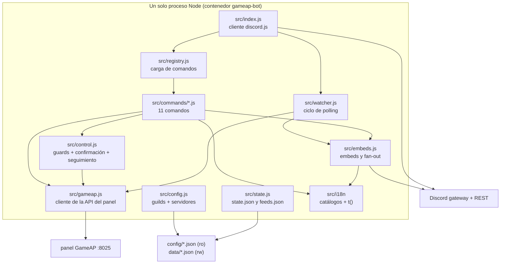
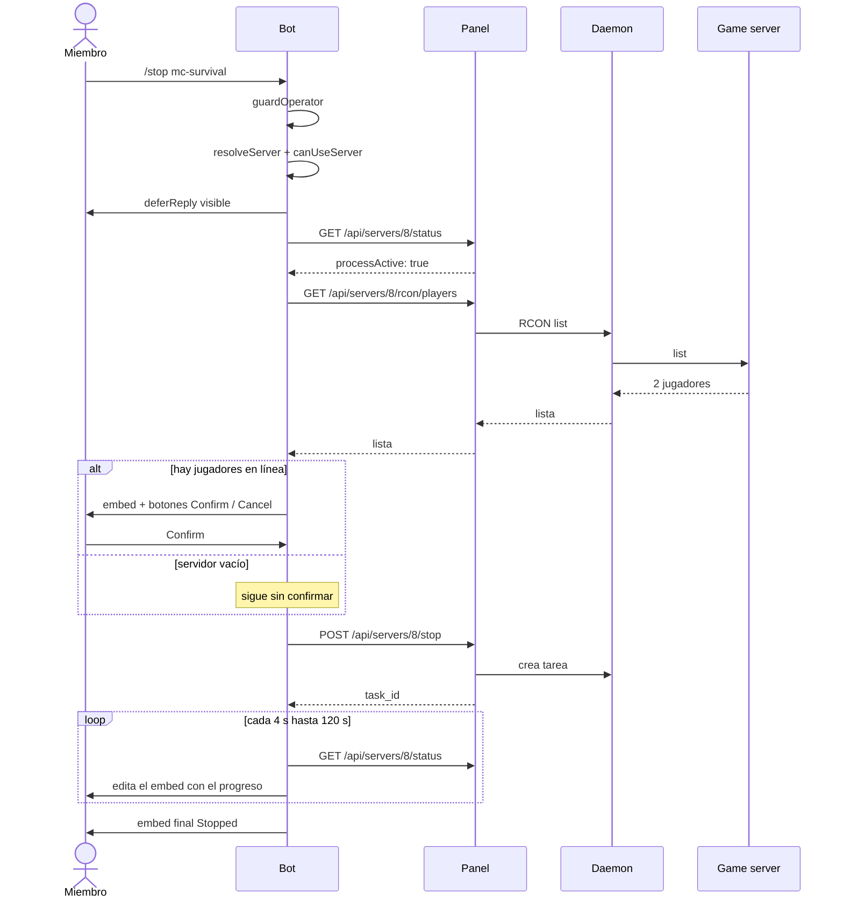
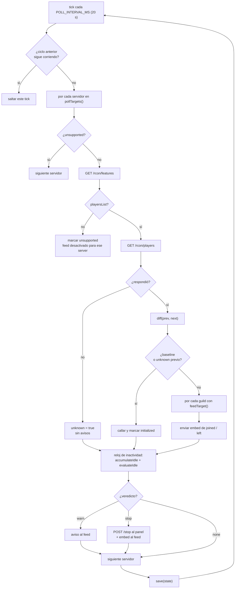

[English](../architecture.md) · **Español**

# Arquitectura

## Piezas

Responsabilidades, en una línea cada una:

| Archivo | Responsabilidad |
|---|---|
| `src/index.js` | Login, carga de comandos, router de interacciones, arranque del watcher, `guildCreate` |
| `src/registry.js` | Fuente única de la lista de comandos (la usan el bot, el deploy y `/help`) y de `GATED_COMMANDS` |
| `src/commands/*.js` | Un comando por archivo: `data` (definición), `help`, `execute`, opcional `autocomplete` |
| `src/commands/language.js` | `/language`: muestra o cambia el idioma de este guild (`data/locale.json`; `auto` lo borra), solo operadores |
| `src/control.js` | Lógica compartida de `/start`, `/stop`, `/restart`: guard, resolución del servidor, confirmación, seguimiento |
| `src/permissions.js` | `isOperator(member, comando)`: el flag Administrator (salvo `adminBypass: false`), luego `commandRoles` del guild para ese comando, luego `operatorRoleIds`, luego todos |
| `src/command-permissions.js` | **Puro**: la visibilidad del lado de Discord, los overrides que recibe un guild por comando con guard |
| `src/config.js` | Resolución multi-guild: alias, servidores visibles, canal de feed, overrides de runtime |
| `src/gameap.js` | Cliente HTTP del panel (timeout 15 s, error con `status`) |
| `src/watcher.js` | Ciclo de polling de jugadores, decisión de anunciar o callar, y reloj de inactividad (auto-apagado) |
| `src/autostop.js` | Lógica **pura** del auto-apagado: resolver config, acumular inactividad, evaluar warn/stop |
| `src/state.js` | Persistencia en disco y `diff()` puro entre dos listas de jugadores |
| `src/embeds.js` | Construcción de embeds y envío a los canales del feed |
| `src/i18n/` | Catálogos de idiomas (`locales/*.json`) y la API de traducción: `t()`, `plural()`, resolución por guild, localizaciones de Discord |
| `src/help.js` | Ayuda general y por comando, generada desde los comandos vivos |
| `src/logger.js` | Log con niveles (`LOG_LEVEL`), sin secretos |
| `src/sync-permissions.js` | Escribe en Discord los permisos por guild (`npm run sync:permissions`); `src/deploy-commands.js` los registra ocultos (`src/discord-app.js` resuelve el app id) |

Todo el texto que ve el usuario está localizado y el idioma es **por guild de Discord**: primero el
override de `/language` (`data/locale.json`), luego la entrada del guild en `guilds.json`, luego los
`defaults`, luego `DEFAULT_LOCALE` y finalmente inglés. Los embeds se construyen con el idioma del
guild al que van, así el fan-out del feed habla el idioma de cada Discord — nunca una config global.

## Flujo de un comando de control (`/stop`)

Si el panel no responde a tiempo, el embed final dice *"Still working — open the GameAP panel to
watch the console"* y la tarea sigue en el daemon: el bot no cancela nada.

## Ciclo del watcher

## Decisiones de diseño y sus motivos

| Decisión | Por qué | Alternativa descartada |
|---|---|---|
| **Node 22 + discord.js** | El bot es REST + embeds; Node ya estaba en el host y los otros proyectos del server también son Node | Python: obligaría a async puro y no aporta aquí (solo valdría si algún día se añade IA local) |
| **Sin webhooks de GameAP** | GameAP v4 **no** tiene webhooks: los eventos del plugin WASM cubren start/stop/restart, tareas del daemon y usuarios, pero **no** entradas/salidas de jugadores | Esperar un webhook de jugadores: no existe |
| **RCON vía panel** | El panel/daemon ejecuta el RCON, así el bot no necesita tocar los puertos de juego ni abrir UFW | RCON directo desde el contenedor: exigiría exponer 5500-5599 y manejar RCON por juego |
| **`network_mode: host`** | UFW bloquea contenedor → host; con red host alcanza `127.0.0.1:8025` sin reglas extra | Red bridge: rompía la comunicación con el panel (mismo problema que tuvo panel→daemon) |
| **`user: "1000:1000"`** | El usuario del host es 1000; así `./data` no queda root-owned | Correr como root: dejaba archivos que el usuario no podía editar |
| **Comandos globales (una sola fuente)** | Funcionan en cualquier guild donde esté el bot y evita el par global+guild que Discord muestra duplicado | Registro por guild: instantáneo pero duplica si conviven ambos |
| **Config en JSON, no en base de datos** | Añadir un guild/canal es editar un archivo: sin migraciones ni UI. `data/` guarda lo mutable | SQLite/Postgres: complejidad injustificada para 2 guilds y 5 servidores |
| **Fan-out por suscripción** | Un ciclo de polling por servidor, y el anuncio se replica a todos los guilds/canales suscritos: N canales no multiplican las llamadas al panel | Un ciclo por canal: N veces más carga sobre el panel |
| **Estado en disco (baseline + unknown)** | Evita el spam de "todos se fueron" cuando el servidor está apagado o el bot reinicia | Estado en memoria: cada reinicio anunciaría un falso "todos salieron" |
| **Auto-apagado en el mismo ciclo de polling** | El reloj de inactividad necesita exactamente los datos que el watcher ya trae (0 jugadores = inactividad); nada de cron ni procesos nuevos, y la lógica de tiempo vive aislada y testeable en `src/autostop.js` | Un cron/tarea programada aparte: duplicaría el polling y no sabría distinguir "0 jugadores" de "no pude consultar" |

## Manejo de errores y concurrencia

- Todas las llamadas al panel tienen **timeout de 15 s** (`AbortSignal.timeout`); los errores llevan `.status`.
- El watcher usa un flag **`busy`**: si un ciclo tarda más que `POLL_INTERVAL_MS`, el siguiente tick se salta (nunca se solapan).
- Un error por servidor **no** aborta el ciclo de los demás.
- `/start`, `/stop` y `/restart` limitan el seguimiento a **120 s**; después el embed avisa y el usuario revisa el panel.
- Los comandos de **lectura** (`/servers`, `/status`, `/players`) responden con un embed descriptivo cuando el servidor está apagado o el juego no soporta listar jugadores, en lugar de un stack de error.

## Límites conocidos

- Si hay **dos servidores Minecraft** levantados al mismo tiempo, el segundo no arranca (limitación del host, no del bot).
- El bot necesita **View Channel**, **Send Messages**, **Embed Links** y **Read Message History** en el canal del feed; no pide ni usa Administrator.
- Sin `announce: true` en `config/servers.json`, un servidor no se sondea (no aparece en el feed).
  Con `autoStop` sí se sondea, aunque no tenga feed.
- El descubrimiento de canales de un guild nuevo se loguea al entrar (`joined guild …`), pero la config **no** se recarga en caliente: para cambios de `config/guilds.json` hace falta reiniciar el contenedor.
