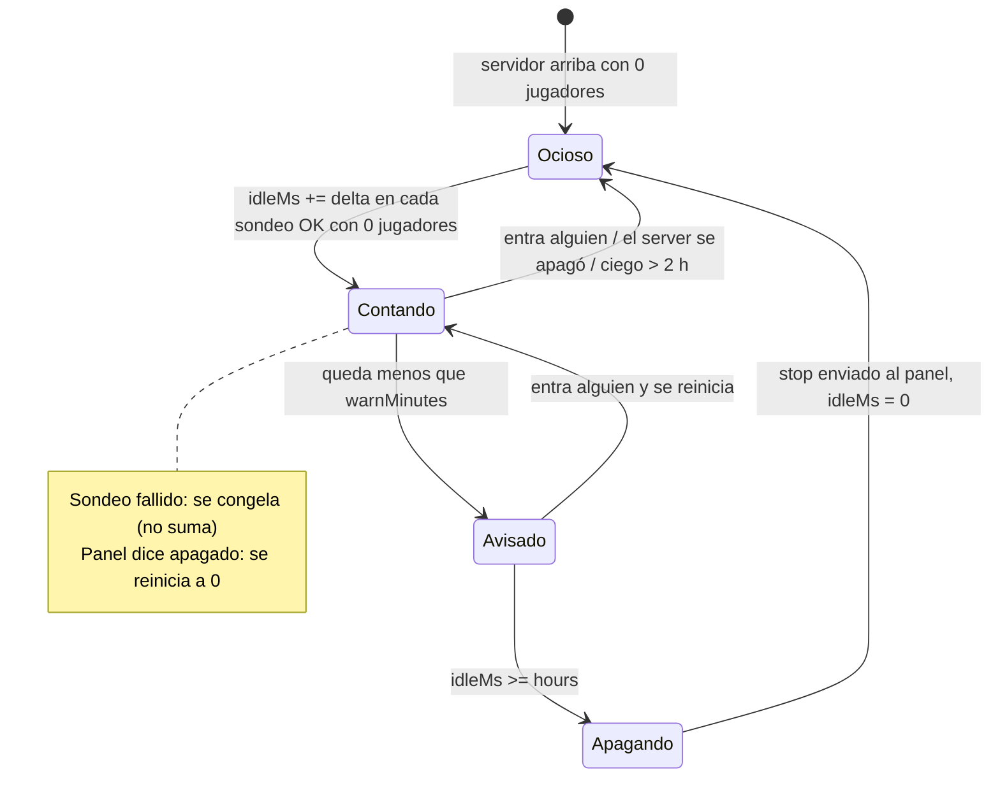
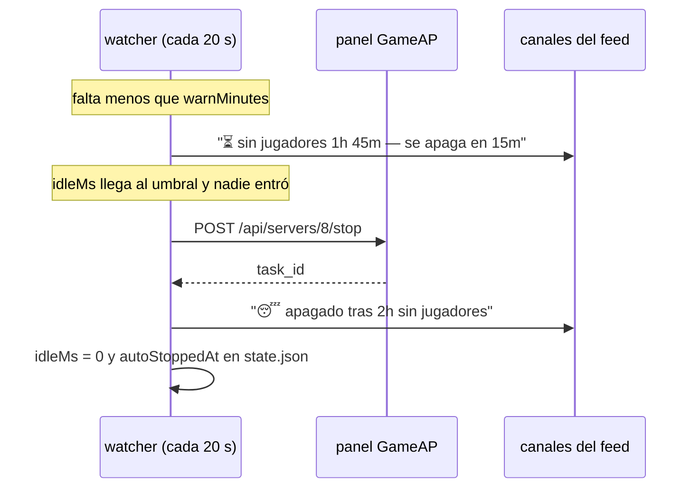

[English](../autostop.md) · **Español**

# Auto-apagado por inactividad (`/autostop`)

Si nadie juega durante **X horas**, el bot apaga el servidor solo y lo avisa en el feed. Todo se
configura desde Discord, sin tocar archivos.

> Default actual: **2 h** con **15 min** de aviso previo, solo para **MC Survival** (`config/servers.json`).
> Los demás servidores quedan desactivados hasta que los actives.

## Cómo funciona

El reloj de inactividad se alimenta del **mismo ciclo de sondeo** que detecta entradas y salidas
(cada `POLL_INTERVAL_MS`, 20 s). No hay cron ni proceso nuevo: una vez por ciclo y por servidor se
acumula tiempo, se decide y, si toca, se manda el `POST /api/servers/{id}/stop` al panel.





## Reglas exactas

| Situación | Qué hace el reloj |
|---|---|
| Sondeo OK y **0 jugadores** | **Suma** el tiempo desde el sondeo anterior |
| Sondeo OK y **≥1 jugador** | **Reinicia** a 0 (y permite un aviso nuevo la próxima vez) |
| Sondeo fallido y el panel dice **apagado** (`processActive: false`) | **Reinicia** a 0: un server apagado no acumula crédito |
| Sondeo fallido pero el panel lo da por activo (RCON roto, arrancando) | **Congela**: no suma. Si sigue ciego **> 2 h**, reinicia a 0 |
| `/start`, `/stop` o `/restart` recién usados | **Gracia de 10 min**: no dispara nada |
| El juego no soporta listar jugadores | El reloj **no aplica** (se avisa una vez en los logs) |

Cuando se apaga, el ciclo termina: `idleMs` vuelve a 0 y se guarda `autoStoppedAt`. Si el `stop`
falla (panel caído), se registra en los logs y **no** se reintenta en bucle — el ciclo debe volver a
madurar.

## Configuración

### Desde Discord (recomendado)

| Comando | Efecto |
|---|---|
| `/autostop mc-survival` | Muestra el estado: ajuste activo, de dónde sale, inactividad acumulada, cuánto falta y en qué canal se avisará |
| `/autostop mc-survival hours:2` | Activa/ajusta el umbral (acepta id numérico también) |
| `/autostop mc-survival hours:2 warn:0` | Igual, pero **sin** mensaje de aviso previo |
| `/autostop mc-survival hours:0` | **Desactiva** el auto-apagado |

- Solo **operadores** (con `operatorRoleIds: []` = todos, como el resto del bot; `commandRoles.autostop` puede darle sus propios roles; el flag Administrator siempre pasa salvo `adminBypass: false`).
- El ajuste se guarda en `data/autostop.json` y se aplica **al instante**, sin reiniciar el bot.
- Límites: `hours` 0-168, `warn` 0-120.

### Por archivo

`config/servers.json` (default del repositorio; el override de Discord tiene prioridad):

```json
"8": {
  "alias": "mc-survival",
  "label": "MC Survival",
  "emoji": "🎲",
  "announce": true,
  "autoStop": { "hours": 2, "warnMinutes": 15 }
}
```

`data/autostop.json` (lo escribe `/autostop`; clave = id del servidor, **no** por Discord — el
servidor es uno solo y dos guilds con umbrales distintos se pisarían):

```json
{ "8": { "hours": 2, "warnMinutes": 15 } }
```

Precedencia: **override de Discord → `config/servers.json` → desactivado**. `/autostop … hours:0`
borra la clave del override; si la config sigue activando el auto-stop, vuelve a aplicar.

### Modo seguro (`AUTOSTOP_DRY_RUN`)

```bash
echo 'AUTOSTOP_DRY_RUN=true' >> .env && docker compose up -d     # loguea y anuncia, no apaga
echo 'AUTOSTOP_DRY_RUN=false' >> .env && docker compose up -d    # vuelve a la normalidad
```

Con `true`, el watcher loguea `[dry-run] would stop server 8 (idle 2h 00m)` y publica el embed con
el pie *DRY RUN — nothing was stopped*. Útil para comprobar la cadena completa sin apagar nada.

## Avisos en el feed

Van a **todos** los canales suscritos al servidor (los mismos de `/feed`):

- Aviso previo (si `warnMinutes > 0`):
  `⏳ No players for **1h 45m** — stopping in **15m** unless someone joins.`
  pie: `Auto-stop after 2h idle · /autostop mc-survival hours:0 to disable`
- Apagado: `😴 Stopped after **2h 00m** with no players.` · pie: `Start it again with /start mc-survival`

Si **ningún** canal está suscrito, el apagado ocurre igual y solo queda en los logs.

## Estado en `data/state.json`

```json
"8": {
  "players": [], "initialized": true, "unknown": false,
  "idle": { "idleMs": 3600000, "idleSince": 1759170000000, "warnedAt": null, "blindMs": 0, "autoStoppedAt": null },
  "lastControlAt": 1759160000000,
  "lastAutoStop": { "at": 1759150000000, "idleMs": 7200000 }
}
```

- `idleMs`: tiempo acumulado sin jugadores (lo que decide el apagado).
- `idleSince`: cuándo empezó a contar (para mostrarlo).
- `warnedAt`: marca del aviso ya enviado en este ciclo (evita repetirlo cada 20 s).
- `lastControlAt`: último `/start`/`/stop`/`/restart` (gracia).
- `lastAutoStop`: último apagado automático.

Borrar `idle` de un servidor es seguro: el reloj arranca de cero en el siguiente sondeo.

## Problemas comunes

| Síntoma | Causa probable | Qué revisar |
|---|---|---|
| No se apaga nunca | `hours: 0`, o el reloj se reinicia porque hay sondeos fallidos | `/autostop <server>` (ahí se ve `Idle now`), `docker logs` con `LOG_LEVEL=debug` |
| Se apaga muy pronto | Hay otro guild/servidor compartiendo la config (es **por servidor**) o el reloj venía acumulado | `/autostop <server>`: mira `Setting from` y `Idle now` |
| No llega el aviso previo | `warn: 0`, o el canal no está suscrito | `/feed <server> on` en el canal; `/autostop <server>` muestra el canal que se avisará |
| Avisa pero no apaga | El `stop` falló (panel/daemon) | `docker logs \| grep auto-stop` |
| No aparece en el feed aunque apague | Ningún canal suscrito | `/feed <server> on` |
| `does not support listing players` | El juego no sabe listar jugadores por RCON | El auto-stop no puede funcionar en ese servidor |

## Cómo probarlo sin arriesgar

1. **Dry-run** con el reloj forzado (ver arriba y `docs/development.md`): anuncia sin apagar.
2. **Aviso real**: dejar el umbral en 2 h y esperar a los 1h45m — no apaga nada.
3. **Apagado real**: `/autostop <servidor-libre> hours:1` y no entrar en una hora. Con Minecraft en
   este host, recuerda que no puede haber dos servidores MC encendidos a la vez.
