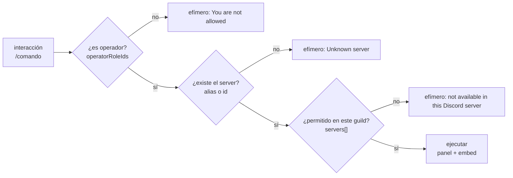
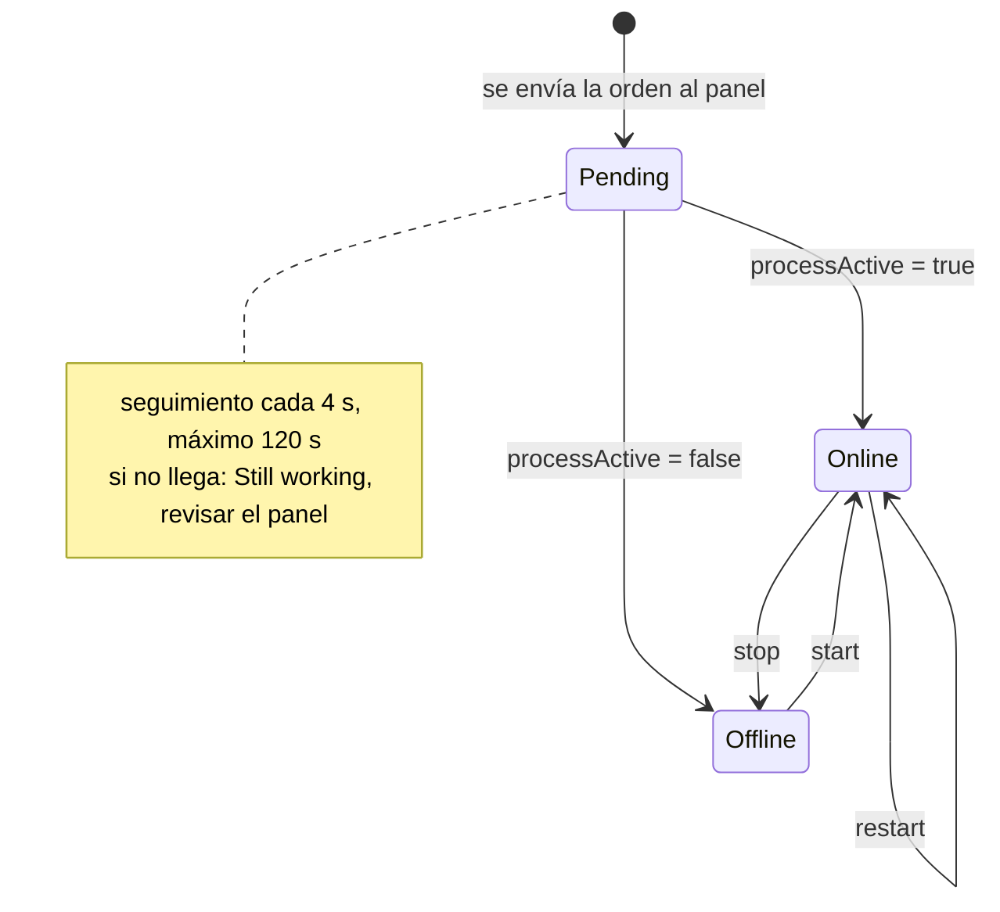

[English](../commands.md) · **Español**

# Comandos

Los 10 comandos se registran **globalmente** (una sola fuente, ver
[architecture.md](architecture.md#decisiones-de-diseño-y-sus-motivos)) y funcionan en cualquier
guild donde esté el bot. Todos declaran `setContexts(Guild)`: no funcionan por DM.

## Resumen

| Comando | Opciones | ¿Quién? | Respuesta | Por debajo |
|---|---|---|---|---|
| `/servers` | — | todos | pública | `GET /api/servers` |
| `/status <server>` | server | todos | pública | `GET /status` + `/rcon/features` + `/rcon/players` |
| `/players <server>` | server | todos | pública | `GET /status` + `/rcon/players` |
| `/start <server>` | server | operadores | pública (progreso) | `POST /start` |
| `/stop <server>` | server | operadores | pública (confirmación) | `POST /stop` |
| `/restart <server>` | server | operadores | pública (confirmación) | `POST /restart` |
| `/rcon <server> <command>` | server, command | operadores | pública | `POST /rcon` |
| `/feed <server> <state>` | server, on\|off | operadores | pública | estado local (`data/feeds.json`) |
| `/autostop <server> [hours] [warn]` | server, hours, warn | operadores | pública | estado local (`data/autostop.json`) + `POST /stop` cuando toca |
| `/help [command]` | command | todos | pública | comandos cargados en memoria |

`<server>` acepta el **id** del panel (`8`) o el **alias** de `config/servers.json`
(`mc-survival`); la comparación ignora mayúsculas. En los comandos con `autocomplete`, el desplegable
solo ofrece los servidores **visibles en ese guild**.

Diferencia práctica: **los comandos de información no piden permiso** (cualquiera del server puede
mirar), y los de control/servidor sí pasan por `guardOperator()`.

## Información

### `/servers`

Lista todos los servidores **visibles en ese guild** con su estado.

- 🟢 `online` · ⚪ `offline` · ❓ sin respuesta del panel.
- Muestra alias/etiqueta del `servers.json` (no el nombre crudo del panel), id, juego e IP:puerto.
- Un servidor "apagado" en el panel se marca offline; uno deshabilitado puede no responder y sale ❓.

### `/status <server>`

Un servidor en detalle: estado, número de jugadores, quién está en línea y si el RCON está
configurado. Consulta la lista de jugadores **solo si** el servidor está activo y el juego soporta
listarlos, por eso funciona igual con Minecraft y con GMod.

Detalle de implementación: si `features.rcon === false`, el embed lleva el pie
*"RCON is not configured for this server"*.

### `/players <server>`

Lista de jugadores por RCON. Responde con un mensaje claro en vez de un error cuando:

| Situación | Lo que verás |
|---|---|
| Servidor apagado | `RCON unavailable: the server is stopped.` |
| El juego no soporta listar jugadores | `This game does not support listing players over RCON.` |
| RCON falló (daemon caído, puerto, etc.) | `RCON error: <status> <mensaje>` |

## Control

`/start`, `/stop` y `/restart` comparten `runControl()` en `src/control.js`:

1. **Guard de operador** → si no, respuesta efímera *"You are not allowed to use this command."*
2. **Resolución del servidor** (alias/id + visibilidad en el guild).
3. `deferReply()` para no perder la interacción (límite de 3 s de Discord).
4. **Atajo de estado ya alcanzado**: `/start` de algo que ya corre dice *"It was already running."*;
   `/stop` de algo apagado dice *"It was already stopped."* (no manda la orden al daemon).
5. **Confirmación con botones** (solo `stop` y `restart`): si hay jugadores, embed naranja con la
   lista y botones `Yes, stop` / `Cancel`, 60 s de espera, y **solo el autor** puede pulsarlos.
   Si nadie confirma (o se agota el tiempo) → *Cancelled*.
6. **Envío de la tarea** al panel y **seguimiento** cada 4 s hasta 120 s editando el embed con el
   tiempo transcurrido. El pie muestra `Daemon task #<id>` cuando el panel lo devuelve.

Para `/restart` el bot considera terminado el proceso cuando **vio el servidor caerse** y luego
volver: así no confunde la reactivación con el estado viejo.

## `/rcon <server> <command>`

Pasa tu comando tal cual al RCON del servidor. Es potente y sin validación (más allá de rechazar
saltos de línea y `;`), por eso es de operadores.

- Ejemplos: `/rcon mc-survival say Server restarts in 5 minutes`, `/rcon mc-survival list`,
  `/rcon mc-survival whitelist list`.
- La salida va en un bloque de código y se corta a **1800 caracteres**.
- Si el comando no produce salida: *"RCON command sent (no output)."*

## `/feed <server> on|off`

Suscribe **el canal donde lo ejecutas** (no todo el servidor) al feed de entradas/salidas de ese
game server. Guarda el override en `data/feeds.json` y lo aplica en memoria sin reiniciar.

- `on` → activa y apunta al canal actual.
- `off` → silencia ese servidor en ese guild.
- Una suscripción nueva arranca **silenciosa**: el primer aviso llega con el siguiente join/leave
  real, no con la gente que ya estaba dentro (ver [feed.md](feed.md)).

## `/autostop <server> [hours] [warn]`

Apaga el servidor automáticamente si nadie juega durante X horas. Detalle completo en
[autostop.md](autostop.md).

- Sin `hours` ni `warn` → muestra el estado (ajuste activo, de dónde sale, inactividad acumulada,
  cuánto falta y en qué canal se avisará).
- `hours:2` activa/ajusta el umbral; `warn:10` cambia los minutos de aviso; `warn:0` = sin aviso.
- `hours:0` lo desactiva (borra el override y vuelve a lo que diga `config/servers.json`).
- Es **por servidor**, no por Discord: el ajuste vale para todos los guilds que vean ese servidor.
- Solo operadores.

## `/help [command]`

- `/help` → guía general: los comandos por categoría, los servidores disponibles **en ese guild**
  y cómo funciona el feed.
- `/help command:<nombre>` → ficha con **Usage** (autogenerado de las opciones), **Options**,
  **Examples** y **Good to know**.
- El parámetro `command` tiene **autocompletado** que filtra los nombres disponibles.

La ayuda no está escrita a mano: `src/help.js` la construye desde los comandos cargados por
`src/registry.js`. Al agregar un comando, basta con exportar
`export const help = { examples: [...], notes: '...' }` y meterlo en una categoría de
`CATEGORIES`; si te olvidas, **falla el test** `src/help.test.js`.

## Errores que puede devolver cualquier comando

| Mensaje | Causa |
|---|---|
| `You are not allowed to use this command.` | El guild tiene `operatorRoleIds` y no tienes ninguno de esos roles |
| `Unknown server: <valor>` | El alias/id no está en `config/servers.json` |
| `That server is not available in this Discord server.` | El guild tiene `servers: [...]` y ese id no está en la lista |
| `Command failed: <mensaje>` | Excepción no controlada (lo añade el router de `index.js`), efímero |
| `RCON failed: <status> <mensaje>` | El panel rechazó/falló el RCON (p. ej. servidor apagado) |
| `Command rejected: line breaks and ";" are not allowed.` | `/rcon` con salto de línea o `;` |
