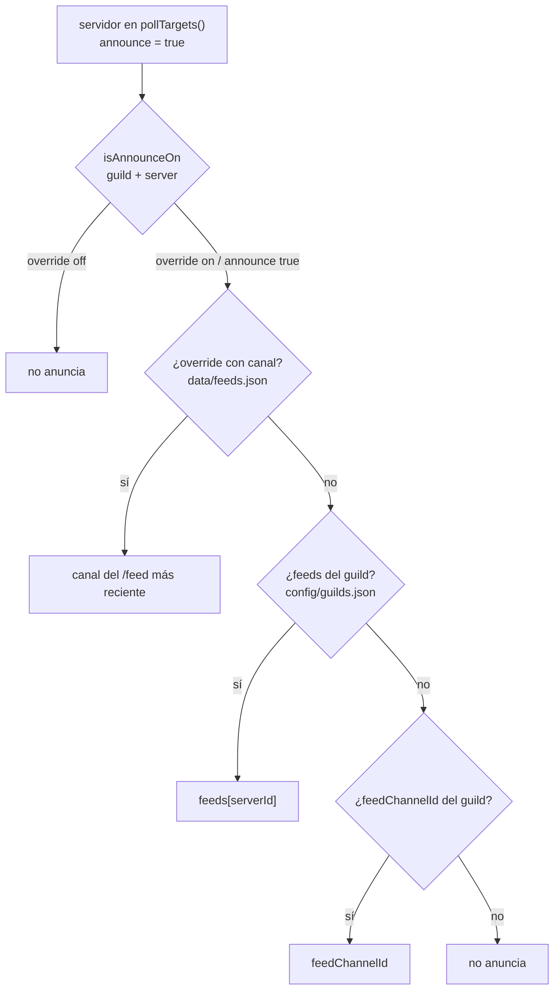

[English](../configuration.md) · **Español**

# Configuración

Cuatro archivos JSON de configuración/estado, un `.env` y un quinto JSON para los overrides del
auto-apagado. Dentro de `config/`, el repo solo versiona las **plantillas** `*.example.json`: los
`config/servers.json` y `config/guilds.json` reales son locales (están en `.gitignore`) porque llevan
los ids de tus guilds, canales y servidores. Los `data/*.json` son **estado en runtime** y se pueden
borrar sin perder configuración.

```
compose.yaml          contenedor (host network, user 1000, mounts)
.env                  secretos: DISCORD_TOKEN, GAMEAP_TOKEN (chmod 600, nunca al repo)
config/servers.json   catálogo de game servers: alias, label, emoji, announce, autoStop
config/guilds.json    por Discord: canal de feed, roles operadores, servidores visibles
data/state.json       watcher: jugadores conocidos, reloj de inactividad y suscripciones
data/feeds.json       overrides de /feed (on/off y canal)
data/autostop.json    overrides de /autostop (por servidor)
```

Primera vez (o clon nuevo):

```bash
cp config/servers.example.json config/servers.json
cp config/guilds.example.json  config/guilds.json    # y editar alias/label/ids reales
```

## Variables de entorno

| Variable | Default | Para qué |
|---|---|---|
| `DISCORD_TOKEN` | — | Token del bot (obligatorio) |
| `GAMEAP_TOKEN` | — | PAT del panel (obligatorio) |
| `GAMEAP_API_URL` | `http://127.0.0.1:8025` | Base de la API del panel |
| `POLL_INTERVAL_MS` | `20000` | Intervalo del watcher (20 s) |
| `LOG_LEVEL` | `info` | `debug`, `info`, `warn`, `error` |
| `AUTOSTOP_DRY_RUN` | `false` | `true` = el auto-apagado solo loguea y anuncia lo que haría, **no** apaga (ojo: se lee al crear el contenedor, hace falta `docker compose up -d`) |
| `AUTOSTOP_FILE` | `./data/autostop.json` | Overrides de `/autostop` |
| `SERVERS_FILE` | `./config/servers.json` | Catálogo |
| `GUILDS_FILE` | `./config/guilds.json` | Config por guild |
| `STATE_FILE` | `./data/state.json` | Estado del watcher |
| `FEEDS_STATE_FILE` | `./data/feeds.json` | Overrides de `/feed` |
| `DISCORD_APP_ID` | — | Solo informativo: `deploy-commands.js` resuelve el id desde el token |

`DISCORD_GUILD_ID` **no** lo usa el código. Antes servía de fallback para el registro por guild y
era la causa de comandos duplicados; hoy el registro por guild exige `--guild <id>` explícito.

## `config/servers.json`

Clave = id del servidor en el panel (string). `announce: true` es lo que mete al servidor en el
sondeo del watcher.

| Campo | Obligatorio | Efecto |
|---|---|---|
| `alias` | recomendado | Nombre corto para los comandos (`/start mc-survival`) y valor del autocompletado |
| `label` | recomendado | Nombre bonito en los embeds (`MC Survival` en vez de `MC Survival Server 1.20`) |
| `emoji` | no | Prefijo del título del embed (`🎲 MC Survival`) |
| `announce` | no | `true` = el watcher lo sondea y puede alimentar feeds |
| `autoStop` | no | `{ "hours": 2, "warnMinutes": 15 }` = apagado automático tras N horas sin jugadores (ver [autostop.md](autostop.md)) |

```json
{
  "8": { "alias": "mc-survival", "label": "MC Survival", "emoji": "🎲", "announce": true,
         "autoStop": { "hours": 2, "warnMinutes": 15 } }
}
```

Un servidor con `autoStop` se sondea aunque **no** tenga `announce: true` (el reloj de inactividad se
alimenta del mismo ciclo), pero sin `announce` no habrá feed de jugadores.

Servidores fuera de este archivo **no existen** para el bot (no salen en `/servers` ni en el
autocompletado, y no se pueden usar en ningún comando).

## `config/guilds.json`

```json
{
  "defaults": { "operatorRoleIds": [], "feedChannelId": null, "servers": null },
  "guilds": {
    "123456789012345678": {
      "feedChannelId": "234567890123456789",
      "operatorRoleIds": [],
      "servers": ["8"],
      "feeds": { "8": "234567890123456789" }
    },
    "345678901234567890": { "operatorRoleIds": [], "servers": null }
  }
}
```

| Campo | Default | Efecto |
|---|---|---|
| `operatorRoleIds` | `[]` | `[]` → **cualquiera** puede usar los comandos de control (setup actual de amigos de confianza). Con ids → solo quien tenga uno de esos roles |
| `servers` | `null` | `null` → ve todos los de `servers.json`. Con lista → solo esos ids |
| `feedChannelId` | `null` | Canal por defecto del feed para ese guild |
| `feeds` | `{}` | Canal específico por servidor: `{ "<serverId>": "<channelId>" }` |

`defaults` se aplica a los guilds que no declaran el campo: así un guild nuevo hereda "todos los
servidores, sin operadores restringidos, sin feed" y se ajusta después.

Un guild que **no** está en el archivo igual puede usar los comandos (con los defaults), pero no
tiene feed hasta que se configure o alguien use `/feed <server> on`.

## Precedencia del canal de feed

El watcher pregunta `feedTarget(guildId, serverId)` y resuelve en este orden: gana el primero que
exista.



Regla corta: **lo que hiciste con `/feed` manda sobre el archivo**, y el archivo manda sobre el
default. Por eso `/feed <server> off` silencia aunque la config diga lo contrario, y `on` apunta al
canal donde lo escribiste.

## `data/feeds.json`

Lo escribe `/feed`; no lo edites a mano salvo emergencia.

```json
{
  "123456789012345678:8": { "on": true, "channelId": "234567890123456789" },
  "123456789012345678:2": { "on": false }
}
```

Clave `"<guildId>:<serverId>"`. Para revertir a lo que dice la config, borra la clave y reinicia
(o reinicia y usa `/feed` de nuevo).

## `data/autostop.json`

Lo escribe `/autostop`; clave = **id del servidor** (no por Discord: el servidor es uno solo y dos
guilds con umbrales distintos se pisarían).

```json
{ "8": { "hours": 2, "warnMinutes": 15 } }
```

Precedencia: override de Discord → `config/servers.json` → desactivado. `/autostop <server> hours:0`
borra la clave (si la config lo activa, vuelve a aplicar). Detalles en [autostop.md](autostop.md).

## `data/state.json`

```json
{
  "servers": { "8": { "players": ["alice"], "initialized": true, "unknown": false } },
  "feeds": { "123456789012345678:8": { "initialized": true } }
}
```

| Campo | Significado |
|---|---|
| `players` | Última lista de jugadores vista |
| `initialized` | Ya se hizo el baseline (la primera lectura no anuncia) |
| `unknown` | El último sondeo falló: se calla y no se inventan salidas |
| `feeds["<guild>:<id>"].initialized` | Esa suscripción ya arrancó en silencio |

Borrar el archivo es seguro: el watcher lo recrea y hace baseline (se pierde el "quién estaba
dentro" pero **no** la configuración).

## Aplicar cambios

| Cambio | Cómo se aplica |
|---|---|
| `data/feeds.json` | Inmediato (lo escribe `/feed` y lo recarga en memoria) |
| `config/guilds.json` o `config/servers.json` | Reiniciar el contenedor: `docker compose restart` (la config se lee una vez y se cachea) |
| `.env` | `docker compose up -d` (recrea con las nuevas variables) |
| Comandos (`src/commands/`) | `npm run deploy` (registro global) + `docker compose up -d --build` |

> `src/config.js` expone `reloadConfig()`, pero ningún camino de runtime lo llama: la recarga en
> caliente quedó fuera de alcance a propósito (reiniciar es un segundo y evita estados a medias).
