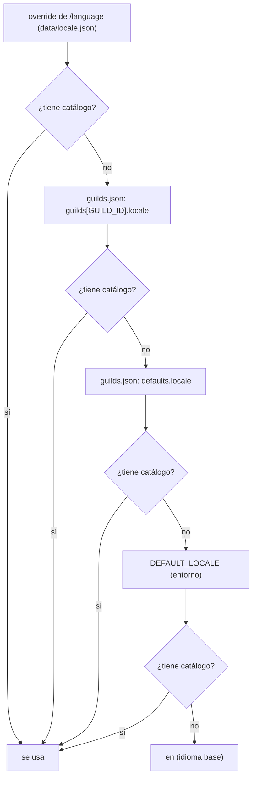

[English](../i18n.md) · **Español**

# Idiomas (i18n)

El inglés es el **idioma base** y el único catálogo que define claves. El español mexicano
(`es-MX`) es el segundo. Agregar un tercer idioma es un archivo JSON — y una línea más si
también quieres que Discord traduzca los metadatos de los comandos.

Aquí nada necesita build y no hay dependencias nuevas: los catálogos son JSON plano, cargado
con `readFileSync`.

## Estructura

```text
src/i18n/
  core.js             reglas puras: claves, interpolación, plurales, fallbacks (sin filesystem)
  index.js            carga locales/*.json y exporta t(), plural(), has(), localizationsFor()
  commands.js         localizeCommand() / localizeOption() para los metadatos de los comandos
  discord-locales.js  etiqueta interna -> locale de Discord (es-MX -> es-419)
  locales/
    en.json           catálogo base: las claves se definen aquí y en ningún otro lado
    es-MX.json        traducción; debe tener exactamente las mismas claves
```

## Cómo se usa

```js
import { t, plural, has } from './i18n/index.js';

t(locale, 'embeds.status.running');                       // "🟢 encendido"
t(locale, 'embeds.control.task', { taskId });             // "Tarea del daemon #42"
plural(locale, 'embeds.confirm.players', players.length); // "<clave>_one" / "<clave>_other"
has(locale, `commands.${name}.notes`);                    // texto opcional
```

- Las claves son rutas con puntos dentro del JSON anidado (`embeds.servers.title`).
- `{param}` interpola. **Un parámetro que no pasaste queda visible** (`{name}`): un error de
  dedo en un catálogo debe notarse, no comerse datos en silencio.
- Una clave que no existe en ningún lado devuelve `⟨clave⟩` y registra un aviso por clave, en
  lugar de un mensaje vacío.
- Si falta una clave en una traducción, se usa el idioma base: un catálogo a medio traducir
  degrada a inglés en vez de romperse.

## De dónde sale el idioma

Se resuelve **una vez por guild** (no por usuario), para que todos los mensajes de un mismo
Discord queden en el mismo idioma:



Un valor sin catálogo se **ignora**: se pasa al siguiente candidato, nunca se sirve a medias.
Las variantes regionales que no tienen archivo propio las sirve el catálogo de su idioma, así
que `es-AR` y el `es-419` de Discord leen `es-MX.json`.

`/language` sin argumentos te dice el idioma efectivo y de dónde viene (override de
`/language`, `config/guilds.json`, `defaults`, `DEFAULT_LOCALE` o el idioma base).
`locale:auto` borra el override y vuelve al idioma configurado. Ver
[commands.md](commands.md#language) y [configuration.md](configuration.md).

## Qué se traduce

| Se traduce | No se traduce (a propósito) |
|---|---|
| Embeds: títulos, nombres de campos, footers (los colores se comparten) | Logs de consola (`docker logs`): son para el operador, no para el jugador |
| Botones (`Yes, stop` / `Sí, apagar`) y respuestas efímeras | **Nombres** de comandos: `/start` es `/start` en todos lados |
| `/help`, incluida la ayuda de opciones y las notas | Ejemplos de `/help`: son líneas de comando |
| Avisos de auto-apagado y el feed de entradas/salidas | Valores que vienen del panel (labels, ids de juego, nombres de jugadores) |

Discord también traduce los **metadatos de los comandos** (descripciones y descripciones de
opciones) con `setDescriptionLocalizations`. Discord tiene su propia lista de locales y no
incluye `es-MX`: el español latinoamericano es `es-419`, mapeado en `discord-locales.js`. Los
nombres de los comandos se dejan canónicos a propósito — lo que escribes tiene que funcionar
igual en cualquier guild.

Los avisos de auto-apagado se construyen **por guild**: el watcher le pasa una fábrica a
`fanOut()`, así cada Discord recibe el aviso en su propio idioma y no en el del primero de la
lista.

## Plurales

El texto plural vive en dos claves, `<clave>_one` y `<clave>_other`, y la forma se elige con
`Intl.PluralRules` para el idioma pedido:

```json
"players_one": "**{count}** jugador está en línea:",
"players_other": "**{count}** jugadores están en línea:"
```

La búsqueda prueba `<clave>_<forma>`, luego `<clave>_other` y luego el idioma base. Los idiomas
con más formas (`few`, `many`, …) funcionan en cuanto existan las claves.

## Agregar un idioma

1. Copia `src/i18n/locales/en.json` a `src/i18n/locales/<etiqueta>.json` (por ejemplo
   `pt-BR.json`) y traduce los valores. **No agregues, borres ni renombres claves**: `en.json`
   es la fuente de las claves.
2. Si quieres que Discord traduzca también los metadatos de los comandos, agrega la etiqueta a
   `src/i18n/discord-locales.js` mapeándola a su locale de Discord (`'pt-BR': 'pt-BR'`). Sin
   esa línea el idioma igual funciona para los mensajes y la ayuda.
3. `npm test` — las guardias fallan si falta una clave, si una traducción define claves que no
   existen en la base, o si el código pide una clave que nadie escribió.
4. `npm run deploy` para volver a registrar los comandos con las localizaciones nuevas.
5. Anúncialo: `/language locale:<etiqueta>` en el guild, o `"locale": "<etiqueta>"` en
   `config/guilds.json`.

## Guardias (tests)

`npm test` (77 tests) incluye:

- **Paridad de catálogos**: cada idioma traduce todas las claves de la base, sin sobrantes.
- **Cobertura**: cada clave que el código pide literalmente debe existir en `en.json`; si
  rompes una, la suite falla.
- **Centinelas**: una lista de frases de cara al usuario que no deben volver a los módulos.
- **Llaves balanceadas**: cada valor tiene el mismo número de `{` y `}`, y ninguno está vacío.
- **Comportamiento por guild**: dos guilds, dos idiomas, un aviso para cada uno.

La documentación en español también se revisa: `npm run check:docs` verifica que
`docs/i18n.md` y `docs/es/i18n.md` (y todos los demás pares) tengan los mismos encabezados y
enlaces válidos.
