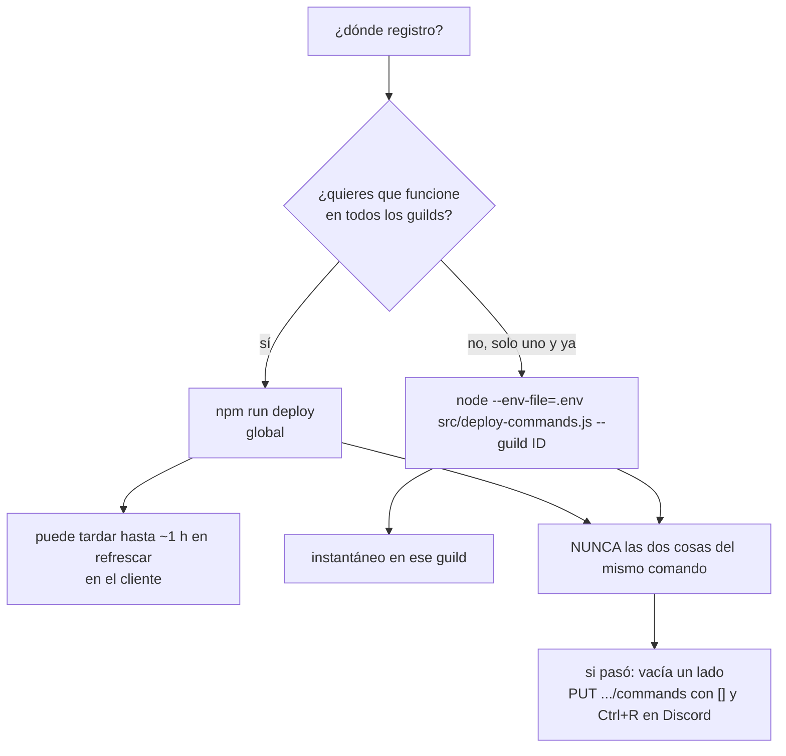

[English](../operations.md) · **Español**

# Operación

Runbook del bot: desplegar, actualizar, rotar credenciales y diagnosticar. Todo se ejecuta desde
`/opt/gameap-discord-bot` (visible también desde Dockge).

## Requisitos

| Cosa | Detalle |
|---|---|
| Docker + compose | El bot corre en el contenedor `gameap-bot` (`network_mode: host`) |
| Node 22 en el host | Solo para `npm run deploy` y `npm test` (el runtime vive en la imagen) |
| PAT del panel | Con las 6 abilities de [gameap-api.md](gameap-api.md#abilities-necesarias) |
| Bot de Discord | Token propio; permisos View Channel, Send Messages, Embed Links, Read Message History |

## Despliegue

```bash
cd /opt/gameap-discord-bot
cp .env.example .env && chmod 600 .env     # y rellenar DISCORD_TOKEN + GAMEAP_TOKEN
cp config/servers.example.json config/servers.json    # y editar alias/label/ids reales
cp config/guilds.example.json  config/guilds.json
npm install
npm test                                   # 77 tests, deben pasar antes de desplegar
npm run deploy                             # registra los comandos GLOBALES
docker compose up -d --build
docker logs -f gameap-bot                  # "loaded 11 commands" + "logged in as ... — N guild(s)"
```

Detalles del `compose.yaml` que no son cosméticos:

- `network_mode: host` — UFW bloquea contenedor → host; así el bot alcanza `127.0.0.1:8025`.
- `build.network: host` — BuildKit no resuelve DNS en este host; `npm ci` dentro del build fallaba.
- `user: "1000:1000"` — el mismo uid del usuario del host, para que `./data` no quede root-owned.
- `logging` con `max-size: 10m` / `max-file: 3` — el log no crece sin control.

## Actualizar código

```bash
cd /opt/gameap-discord-bot
git pull                     # o edita los archivos directamente
npm test
docker compose up -d --build # reconstruye y recrea
```

Si tocaste `src/commands/` (nombre, descripción u opciones), **además**:

```bash
npm run deploy
```

## Usar la imagen publicada

El workflow `docker` (`.github/workflows/docker.yml`) corre toda la suite y publica la imagen en
el GitHub Container Registry:

| De dónde viene el build | Etiquetas que publica |
|---|---|
| push a `main` | `latest`, `sha-<corto>` |
| tag `v1.2.3` | `1.2.3`, `1.2`, `latest`, `sha-<corto>` |
| pull request | nada: solo compila, para validar el Dockerfile |
| manual ("Run workflow") | las mismas etiquetas de la referencia donde corra |

Para correr desde el registro en vez de construir en el host, cambia el bloque `build:` por la
imagen; el resto del servicio no cambia (`env_file`, los montajes `./data` y `./config`,
`network_mode: host`):

```yaml
services:
  gameap-bot:
    image: ghcr.io/neyzerth/gameap-discord:latest
    # build:              # puedes dejar los dos: con --build construye local
    #   context: .
    #   network: host
```

Después `docker compose pull && docker compose up -d`. Fija una versión (`:1.2.3`) si prefieres
no seguir `latest`.

La imagen lleva **solo** `config/*.example.json`: el `.dockerignore` deja fuera del contexto de
build el `.env`, `config/servers.json` y `config/guilds.json`, así que una imagen que baje
cualquiera no trae ids ni tokens. Por eso mismo, un contenedor arrancado desde la imagen
**necesita** tu config montada (o `SERVERS_FILE`/`GUILDS_FILE` apuntando a ella) y el `.env`
pasado con `env_file`. El paquete nace privado: ajusta su visibilidad en la configuración del
paquete en GitHub si lo quieres público — y si sigue privado, haz `docker login ghcr.io` en el
host antes.

## Registro de comandos: una sola fuente



Vaciar el registro por guild de un servidor (requiere el token del bot):

```bash
curl -X PUT "https://discord.com/api/v10/applications/<APP_ID>/guilds/<GUILD_ID>/commands" \
  -H "Authorization: Bot $DISCORD_TOKEN" -H 'Content-Type: application/json' -d '[]'
```

Los globales se cambian con `npm run deploy`. Si el cliente muestra comandos viejos o duplicados,
`Ctrl+R` en Discord limpia la caché local.

## Credenciales

| Secreto | Dónde | Rotación |
|---|---|---|
| `DISCORD_TOKEN` | `.env` (chmod 600) | Developer Portal → Bot → Reset Token → actualizar `.env` → `docker compose up -d` |
| `GAMEAP_TOKEN` (PAT) | `.env` | Panel → Perfil → API tokens → crear uno nuevo con las mismas abilities, ponerlo en `.env`, recrear el contenedor y revocar el viejo |

Reglas: el `.env` nunca va al repo (ya está en `.gitignore`), los logs no imprimen tokens, y el PAT
del panel se debe crear con **solo** las 6 abilities necesarias.

## Añadir un Discord nuevo (guild)

1. Invitar el bot con el enlace del portal:
   `https://discord.com/oauth2/authorize?client_id=<APP_ID>&scope=bot%20applications.commands&permissions=84992`
   (permisos: View Channel 1024 + Send Messages 2048 + Embed Links 16384 + Read Message History 65536).
2. Leer los logs: al entrar, el bot imprime `joined guild <nombre> (<id>) — text channels: #canal(<id>) …`.
3. Agregar el bloque en `config/guilds.json` (opcional: sin bloque funciona con los defaults, pero
   sin feed):

```json
"<GUILD_ID>": { "feedChannelId": "<CHANNEL_ID>", "servers": ["8"], "operatorRoleIds": [] }
```

4. `docker compose restart gameap-bot` y verificar `— 2 guild(s)` en el log.
5. Prueba real: inyectar un jugador ficticio en `data/state.json` y reiniciar (ver
   [development.md](development.md#probar-el-feed-sin-jugadores-reales)).

## Añadir un game server

1. En `config/servers.json`, añadir el id del panel con `alias`, `label`, `emoji` y `announce`:

```json
"11": { "alias": "valheim", "label": "Valheim", "emoji": "🪓", "announce": true }
```

2. `docker compose restart gameap-bot` (la config se cachea al arrancar).
3. Comprobar `/servers` y, si quieres feed, `/feed valheim on` en el canal.
4. Si el juego no soporta listar jugadores, el watcher lo detecta y lo deja fuera del feed con un
   aviso en los logs (una sola vez).

## Logs y diagnóstico

```bash
docker logs --tail 50 gameap-bot          # lo normal: loaded N commands, logged in, baselines
docker logs -f gameap-bot | grep -i warn  # problemas de panel/RCON/canales
docker inspect gameap-bot --format 'restarts={{.RestartCount}} status={{.State.Status}}'
docker stats --no-stream gameap-bot       # huella: ~30 MB de RAM, CPU casi 0
```

Para más detalle, poner `LOG_LEVEL=debug` en `.env` y recrear: así se ven los ciclos con servidor
apagado (`server 8 is offline; skipping poll`).

| Síntoma | Causa probable | Arreglo |
|---|---|---|
| `DISCORD_TOKEN is required` / `GAMEAP_TOKEN is required` | `.env` sin la variable (o env_file mal) | Rellenar `.env`, `docker compose up -d` |
| `Command failed` en todos los comandos | PAT sin abilities o panel caído | `curl /api/servers` con el PAT; revisar abilities |
| Los comandos no aparecen en Discord | Registro global sin propagar | `Ctrl+R`; `/help` en un canal; verificar `npm run deploy` |
| Aparecen comandos **duplicados** | Registro global + por guild, o app con *user install* | Vaciar el set por guild (arriba) y desactivar user install en el portal; `Ctrl+R` |
| El feed nunca publica | Sin `announce: true`, sin `feedTarget()`, o `unsupported` | `docker logs` (busca `baseline server`), `/feed <server> on` |
| `could not announce to <id>` | El bot sin permisos en ese canal | Dar View Channel + Send Messages + Embed Links |
| El contenedor reinicia en bucle | Token inválido o `.env` con comillas | `docker logs --tail 20` (sale el error de login) |
| El servidor se apaga solo | Auto-apagado por inactividad (`/autostop`) | `/autostop <server>` y el canal del feed: el aviso previo explica el motivo |
| `/autostop` no apaga nada | `hours: 0`, o el reloj se reinicia por sondeos fallidos | `/autostop <server>` (mira `Idle now`), `LOG_LEVEL=debug` |
| `AUTOSTOP_DRY_RUN=true` y no aplica | Las variables del contenedor se fijan al crearlo | `docker compose up -d --force-recreate` y `docker exec gameap-bot printenv AUTOSTOP_DRY_RUN` |
| `/start` no arranca nada y el embed se queda "Starting…" | **FIFO viejo del socket systemd** (ver abajo) o otro Minecraft corriendo (límite del host) | `/srv/gameap/fix-gameap-server-start.sh --check <uuid>`; revisar la consola en el panel |

### `/start` falla siempre y el panel tampoco arranca: FIFO huérfano

Síntoma en el panel/API: la tarea `gsstart` sale `success` pero el servidor no arranca (o el panel
devuelve error). En el journal:

```
gameap-server-<uuid>.socket: Failed to open FIFO /srv/gameap/.systemd-services/<uuid>.stdin: File exists
gameap-server-<uuid>.socket: Failed with result 'resources'.
gameap-server-<uuid>.service: Start request repeated too quickly / Failed with result 'start-limit-hit'
```

Causa **exacta** (leída en `src/core/socket.c` de systemd 255, `fifo_address_create`): al enlazar un
`ListenFIFO`, systemd acepta un FIFO que ya exista **solo si** es un FIFO, su modo es exactamente
`SocketMode & ~umask` **usando la umask del proceso systemd** y uid/gid son los de systemd. Si no,
devuelve `-EEXIST` → *"Failed to open FIFO …: File exists"*. En este host la umask de PID1 es
**0000** (`/proc/1/status`), así que el modo exigido es **0666**; cualquier FIFO en 0664/0644/0600
falla. Consecuencia: socket `failed`; el servicio arranca **sin socket** (`Got no socket` en el
journal), sale al instante y, con `Restart=always`, cae en `start-limit-hit`. La tarea `gsstart` del
panel sale `success` igual, así que el error puede aparecer minutos después del intento.

> **Ojo con `UMask=` en el unit `.socket`**: systemd aplica la umask de la unidad al crear el nodo,
> pero compara contra la umask del proceso. Poner `UMask=0002` hace que systemd cree el FIFO en 0664
> y lo rechace él mismo después. La documentación de este stack llevó `UMask=0002` un rato: era
> incorrecto y solo cambiaba un EEXIST por otro. Lo correcto es `UMask=0000` (lo creado y lo exigido
> coinciden en 0666).

Arreglo (una vez por servidor, con sudo):

```bash
sudo /srv/gameap/fix-gameap-server-start.sh <uuid>     # borra el FIFO, resetea unidades, deja drop-in
# luego /start desde el panel o Discord
```

El script instala un drop-in `…<uuid>.socket.d/override.conf` con **`UMask=0000`**, un `ExecStartPre`
que borra restos y pre-crea el FIFO en 0666 (`rm -f …; mkfifo -m 0666 …; chmod 0666 …`) y
`RemoveOnStop=true`. Los drop-ins sobreviven a que el daemon reescriba el unit en cada arranque. El
daemon de GameAP **no** crea FIFOs (no hay `mkfifo` en su código), así que nadie compite por el
archivo.

**Plan B** si el FIFO sigue dando guerra: `sudo /srv/gameap/fix-gameap-server-start.sh --no-socket
<uuid>` quita la dependencia del socket en el `.service` (`Sockets=` vacío + `StandardInput=null`).
El servidor arranca siempre; se pierde el **envío** de comandos por la consola del panel (leer el log
sigue funcionando y RCON no se toca).

Los uuid: `ls /etc/systemd/system | grep 'gameap-server-.*\.socket$'`.

## Respaldos

Lo que vale la pena respaldar: `config/` (catálogo y guilds) y, opcionalmente, `data/` (estado del
feed y overrides de `/language`). El `.env` va aparte, cifrado, porque tiene los secretos.

```bash
tar czf /var/backups/gameap-bot-config-$(date +%F).tar.gz -C /opt/gameap-discord-bot config .env
```

`data/state.json`, `data/feeds.json` y `data/locale.json` son desechables: se recrean, y borrarlos
solo cuesta un baseline silencioso (state) o los overrides de runtime (`/feed`, `/language`).
`data/locale.json` en particular es seguro de borrar: cada guild vuelve a su idioma configurado
(`guilds.json` → `DEFAULT_LOCALE` → `en`).

## Checklist después de cualquier cambio

- [ ] `npm test` en verde (77 tests)
- [ ] `docker logs --tail 10` sin `ERROR`, con `loaded 11 commands` y `— N guild(s)`
- [ ] `docker inspect ... RestartCount` en 0
- [ ] Un comando real probado (`/servers` y `/players <server>`)
- [ ] Si tocaste el feed: inyectar un jugador ficticio y ver el aviso en el canal correcto
