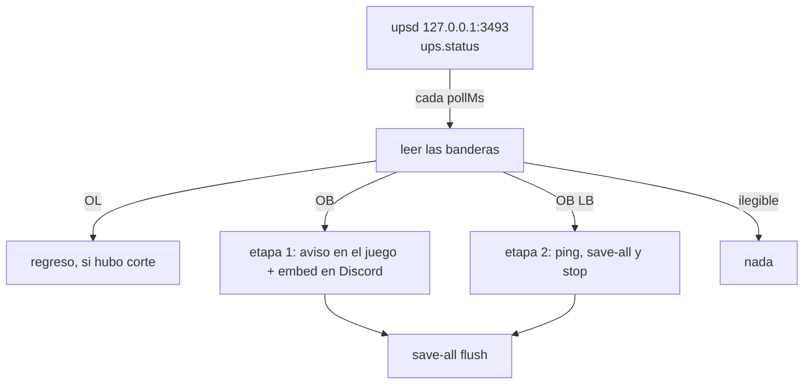

[English](../power.md) · **Español**

# Cortes de energía (UPS vía NUT)

Cuando se va la luz, el bot puede avisar a los jugadores en el juego y en Discord **antes** de que el
host se quede sin batería y se apague. Lee el UPS directo — sin GameAP y sin servicios extra: `upsd`
contesta consultas de lectura en `127.0.0.1:3493` y no pide credenciales.

> **Función opcional.** Sin `config/power.json` (o con `enabled: false`) el ciclo nunca arranca:
> ni socket, ni temporizador, ni ruido en los logs. Nada más del bot cambia.

## Cómo funciona

Un temporizador propio (10 s por defecto) lee `ups.status` de NUT y mira sus banderas: `OL` (en
línea), `OB` (en batería), `LB` (batería baja). Cualquier otra cosa — `RB`, `CAL`, un timeout, una
respuesta que no se puede leer — significa **silencio**: una lectura fallida nunca es un corte.

Es un temporizador aparte y no un paso del watcher de jugadores a propósito: el ciclo del watcher
puede tardar segundos hablando con el panel, y la ventana de batería baja es corta (el host empieza
a apagarse un par de minutos después de `LB`).



Dos etapas en vez de una, a propósito: un solo mensaje tipo "el server se apagará en los próximos
minutos" mentiría en un parpadeo de 30 segundos, donde el host no se apaga.

## Reglas exactas

| Situación | Qué hace el bot |
|---|---|
| `OB` por primera vez en el episodio | Aviso en el juego (title + chat + `save-all flush`) y el embed en Discord, sin mención |
| `LB` por primera vez en el episodio | Aviso en el juego, el embed **con la mención configurada** y el apagado por batería baja |
| `LB` como primera lectura | Las dos etapas, en orden |
| Vuelve la luz tras un episodio | "Volvió la luz" con la duración real y si el servidor quedó apagado |
| `OL` sin corte previo | Nada |
| Lectura fallida (timeout, `ERR`, banderas desconocidas) | Nada: el estado guardado no se toca |
| El bot reinicia en medio de un corte | El corte no se anuncia dos veces; el regreso sí |

Cada etapa se anuncia **una vez por episodio**, y el episodio se cierra cuando vuelve `OL`.

## Configuración

### Por archivo

`config/power.json` (gitignored; el repo trae [`config/power.example.json`](../../config/power.example.json)):

```json
{
  "enabled": true,
  "nut": { "host": "127.0.0.1", "port": 3493, "ups": "myups", "timeoutMs": 3000 },
  "pollMs": 10000,
  "servers": ["1"],
  "channels": { "123456789012345678": "234567890123456789" },
  "notifyEveryoneOnLowBattery": true,
  "lowBatteryMention": "@everyone",
  "stopServersOnLowBattery": true,
  "stopDelayMs": 5000
}
```

| Clave | Default | Qué hace |
|---|---|---|
| `enabled` | `false` | La función solo arranca con `true` |
| `nut.ups` | — | El nombre del UPS tal como está configurado en NUT (obligatorio) |
| `nut.host` / `nut.port` | `127.0.0.1` / `3493` | Dónde escucha `upsd` |
| `nut.timeoutMs` | `3000` | Timeout de lectura, 500-15000 |
| `pollMs` | `10000` | Cada cuánto se lee el estado, 2000-60000 |
| `servers` | — | Ids del panel que se avisan en el juego y se detienen (obligatorio) |
| `channels` | `{}` | `id del guild → id del canal`; un guild sin entrada usa su canal del feed |
| `notifyEveryoneOnLowBattery` | `true` | Agrega la mención al embed de la etapa 2 |
| `lowBatteryMention` | `"@everyone"` | La mención en sí (una mención de rol también sirve) |
| `stopServersOnLowBattery` | `true` | Manda el `stop` del panel en la etapa 2 |
| `stopDelayMs` | `5000` | Pausa entre el aviso y ese `stop`, 0-30000 |

Sin `nut.ups` o sin `servers` el archivo se ignora, y el log dice por qué.

### Apagado por batería baja

En la etapa 2 el bot avisa a los jugadores, espera `stopDelayMs` y manda
`POST /api/servers/{id}/stop` por cada servidor de la lista que esté encendido, así el mundo queda
guardado y el panel dice **stopped** en lugar de morir con el host. El servidor **no** se vuelve a
prender solo: después del corte alguien tiene que usar `/start <server>`.

### Modo seguro (`POWER_DRY_RUN`)

```bash
echo 'POWER_DRY_RUN=true' >> .env && docker compose up -d --force-recreate   # loguea y publica embeds, no manda nada
echo 'POWER_DRY_RUN=false' >> .env && docker compose up -d --force-recreate  # vuelve a lo normal
```

`docker restart` no basta: las variables de entorno se fijan cuando se **crea** el contenedor. Los
embeds llevan el pie *PRUEBA — no se mandó nada al juego ni se detuvo el server*, y el log muestra
las líneas RCON exactas que saldrían.

## Qué anuncia

### En el juego (RCON)

A través del panel (`POST /api/servers/{id}/rcon`), así que no se abre ningún puerto del juego y el
que habla RCON es el daemon. La etapa 1 manda un `title`, un `tellraw` y `save-all flush`; la etapa 2
los repite sin el título grande. El texto vive en el catálogo i18n (por guild) y **no lleva emoji**:
hay un test que falla si aparece uno.

### En Discord

| Etapa | Título | Extra |
|---|---|---|
| 1 | ⚡ Se fue la luz | Batería `%` y autonomía como campos |
| 2 | 🔋 Batería baja — apagado inminente | La mención configurada |
| Regreso | ✅ Volvió la luz | Duración, y cómo prender el servidor si quedó apagado |

## Estado en `data/state.json`

```json
"power": {
  "status": "low", "obSince": 1759170000000, "stage1At": 1759170000000,
  "stage2At": 1759170600000, "stoppedAt": 1759170605000,
  "charge": "87", "runtime": "2h 05m"
}
```

- `obSince`: cuándo se fue la luz (el mensaje de regreso mide el corte desde aquí).
- `stage1At` / `stage2At`: los marcadores que evitan repetir el mismo aviso cada 10 s.
- `stoppedAt`: este corte terminó con el bot apagando el servidor.

Borrar `power` es seguro: la siguiente lectura empieza un episodio nuevo.

## Problemas comunes

| Síntoma | Causa probable | Qué revisar |
|---|---|---|
| Nunca anuncia nada | `enabled: false`, falta el archivo, o `servers` vacío | `docker logs gameap-bot \| grep -i power` |
| El log dice `NUT read failed` | No hay `upsd` alcanzable, puerto equivocado o firewall | `printf 'GET VAR myups ups.status\n' \| nc 127.0.0.1 3493` |
| No hay aviso en el juego | El servidor está apagado, así que el RCON se salta | `/status <server>` |
| El aviso de Discord no aparece | No hay canal para ese guild, o el guild no puede ver el servidor | `docker logs \| grep "power notice"` |
| La mención no suena | Al bot le falta **Mention Everyone** en ese canal | Permisos del canal → rol del bot |
| El servidor se apagó y nadie dijo por qué | Eso es la etapa 2 funcionando | `data/state.json` → `stoppedAt` |

## Cómo probarlo sin riesgo

1. **Dry run**: `POWER_DRY_RUN=true` y `docker compose up -d --force-recreate`. Todo se loguea y el
   embed se publica; no se manda nada al juego ni se detiene ningún servidor.
2. **UPS falso**: apunta `nut.port` a un servidor TCP mínimo que conteste `LIST VAR` con
   `ups.status "OB"` y mira las tres etapas contra el servidor real. Cubre toda la cadena sin tocar
   el UPS.
3. **La prueba real**: desenchufa el UPS de la pared 3 minutos con el servidor encendido. La etapa 1
   debe salir dentro de un ciclo de sondeo, y al reconectar debe publicar el regreso con la duración.
   Tres minutos nunca llegan a `LB`, así que no se apaga nada.
