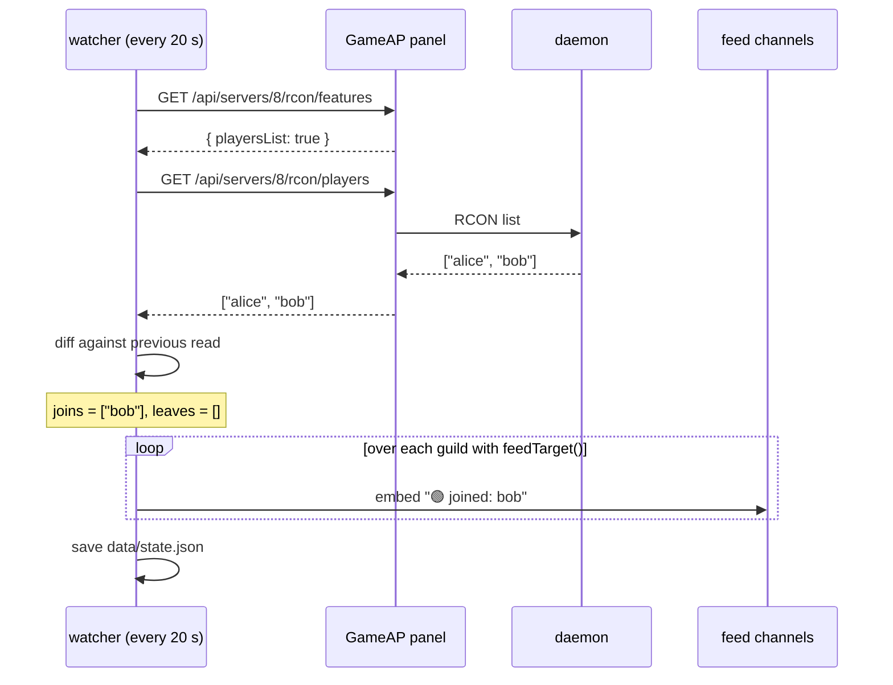
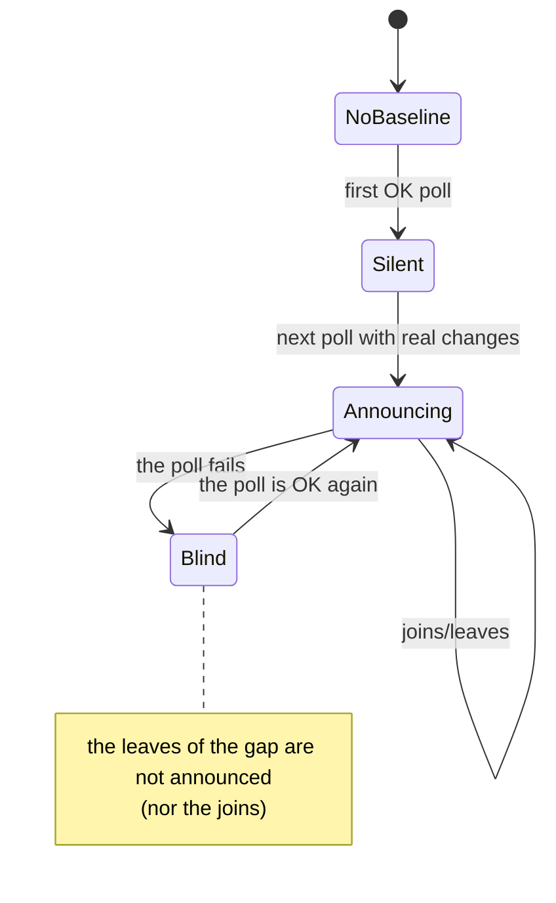

**English** · [Español](es/feed.md)

# The join and leave feed

The feed is the only part of the bot that does **not** respond to a command: a background cycle watches the player list and publishes what changed.

## Cycle

Every `POLL_INTERVAL_MS` (20 s by default) the watcher polls the servers from `pollTargets()` (those with `announce: true` in `config/servers.json`), **once per server**, regardless of how many channels are watching it.



Before asking for players, the watcher checks `rconFeatures()`. If the game doesn't support `playersList`, it marks the server as `unsupported` in memory, logs once (`server 8 does not support listing players; feed disabled for it`) and doesn't try again in that process: so it doesn't generate errors every 20 s.

## Anti-spam rules (why you'll almost never see weird notices)

| Situation | Behavior | Reason |
|---|---|---|
| First poll of a server (`initialized: false`) | **Silence**, the list is stored as-is | Otherwise the bot startup would announce "5 joined" to everyone |
| The poll fails (`unknown = true`) | **Silence** until it responds again, and no departures are announced | Don't invent "everyone left" because the panel/RCON failed |
| Server freshly subscribed with `/feed on` | **Silence** the first time (baseline per subscription) | Avoids the "everyone joined" when opening a new channel |
| Bot restarted | **Silence** (the state is on disk, so it keeps what it knew) | Without persistent state, every restart looked like a stampede |
| Server shut down (`processActive: false`) | **Silence** | A shutdown is not "players left" |
| No changes between two polls | Nothing is sent | No noise |
| Several channels subscribed to the same server | One embed per channel, with a single poll | Efficiency: N channels ≠ N panel calls |



## Notice format

One embed per change, with the same rules in all channels:

- Author: `🎲 MC Survival` (emoji + label from `servers.json`).
- Body: `🟢 joined: alice` and/or `🔴 left: bob` (both can happen in the same cycle).
- Color: green if there were only joins, amber if there were leaves.
- Footer: `Online now: 3`.
- Timestamp of when the notice is sent.

Real verification example:

```
🎲 MC Survival :: 🔴 left: alice            · footer: Online now: 0
```

## Typical operations

**Re-baseline of a server** (for example, after moving players by hand): delete its entry in `data/state.json` and restart the container; the next poll will be silent and store the current list as truth.

```bash
python3 - <<'PY'
import json
p = '/opt/gameap-discord-bot/data/state.json'
s = json.load(open(p)); s['servers'].pop('8', None); json.dump(s, open(p, 'w'), indent=2)
PY
docker restart gameap-bot
```

**Silence a channel**: `/feed mc-survival off` in that channel.
**Move the feed to another channel**: `/feed mc-survival on` in the new channel (the override points to the channel where you ran it).
**Back to the config**: delete the `"<guild>:<server>"` key from `data/feeds.json` and restart.

## What about inactivity auto-shutdown?

The **same watcher** feeds the auto-shutdown clock (`/autostop`): when an OK poll returns 0 players, it starts counting time, warns the feed when little time is left and shuts the server down when the threshold is reached. Notices go to the same subscribed channels (`feedTarget`), so in the feed channel you can see all three things: joins/leaves, the advance warning and the automatic shutdown.

Details, rules and how to test it: [autostop.md](autostop.md).

## Common problems

| Symptom | Likely cause | What to check |
|---|---|---|
| Nothing ever arrives at the channel | Missing `announce: true` or the guild has no `feedTarget()` | Container `logs`: look for `baseline server 8`; and `/feed` with `on` |
| One notice arrived and then nothing | Nobody actually joined/left | Try `/players mc-survival` |
| The channel floods with notices on startup | State deleted and server shut down | Check `data/state.json` (it must exist with `players`) |
| `does not support listing players` | The game doesn't support `list` via RCON | Normal: that server can't have a feed |
| `could not announce to <id>` | The bot lost permission in the channel (or it was deleted) | Permissions: View Channel + Send Messages + Embed Links |