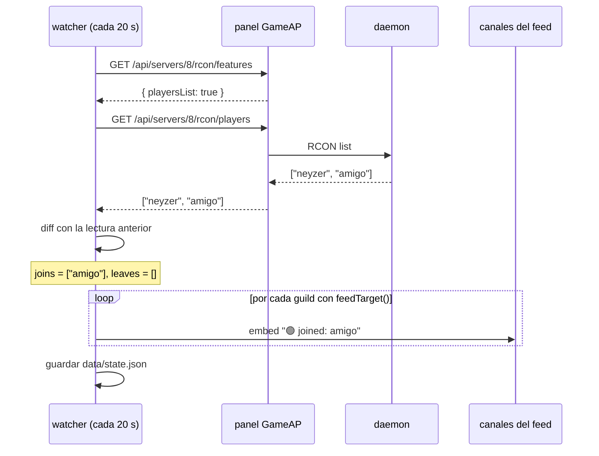
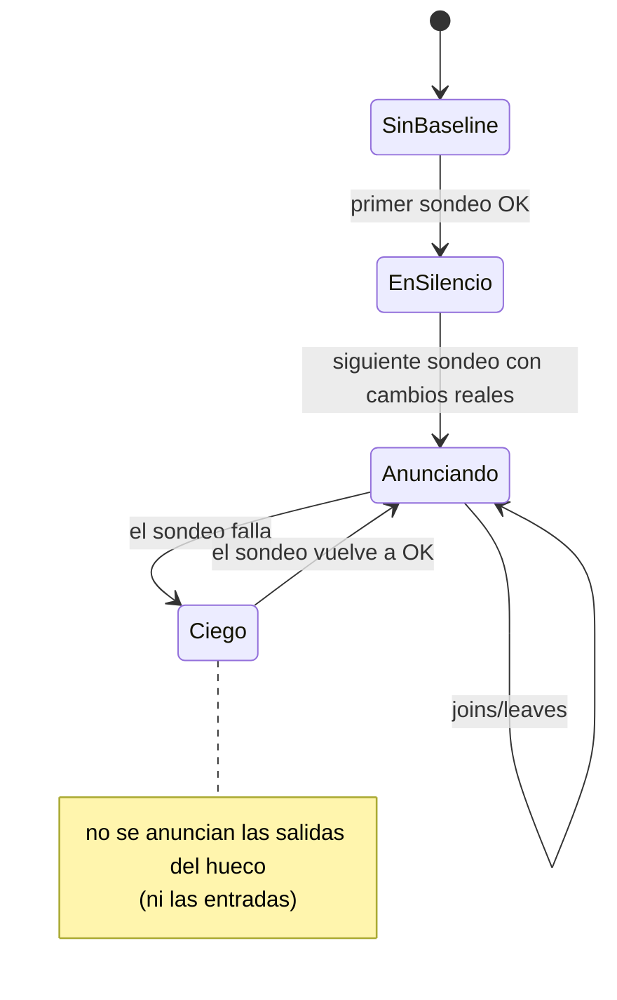

# El feed de entradas y salidas

El feed es la única parte del bot que **no** responde a un comando: un ciclo en segundo plano mira
la lista de jugadores y publica lo que cambió.

## Ciclo

Cada `POLL_INTERVAL_MS` (20 s por defecto) el watcher recorre los servidores de `pollTargets()`
(los que tienen `announce: true` en `config/servers.json`), **una sola vez por servidor**,
independientemente de cuántos canales lo estén mirando.



Antes de pedir jugadores, el watcher verifica `rconFeatures()`. Si el juego no soporta
`playersList`, marca el servidor como `unsupported` en memoria, loguea una sola vez
(`server 8 does not support listing players; feed disabled for it`) y no vuelve a intentarlo en
ese proceso: así no genera errores cada 20 s.

## Reglas anti-spam (por qué casi nunca verás avisos raros)

| Situación | Comportamiento | Motivo |
|---|---|---|
| Primer sondeo de un servidor (`initialized: false`) | **Silencio**, se guarda la lista tal cual | Si no, el arranque del bot anunciaría "entraron 5" a todos |
| El sondeo falla (`unknown = true`) | **Silencio** hasta que vuelva a responder, y no se anuncian salidas | No inventar "todos se fueron" porque el panel/RCON falló |
| Servidor recién suscrito con `/feed on` | **Silencio** la primera vez (baseline por suscripción) | Evita el "todos entraron" al abrir un canal nuevo |
| Bot reiniciado | **Silencio** (el estado está en disco, así que conserva lo que sabía) | Sin estado persistente, cada reinicio parecía una estampida |
| Servidor apagado (`processActive: false`) | **Silencio** | Un apagado no es "se fueron los jugadores" |
| Sin cambios entre dos sondeos | No se envía nada | Sin ruido |
| Varios canales suscritos al mismo servidor | Un embed por canal, con un solo sondeo | Eficiencia: N canales ≠ N llamadas al panel |



## Formato del aviso

Un embed por cambio, con las mismas reglas en todos los canales:

- Autor: `🎲 Ludopatía` (emoji + label del `servers.json`).
- Cuerpo: `🟢 joined: neyzer` y/o `🔴 left: amigo` (se pueden dar juntos en el mismo ciclo).
- Color: verde si solo hubo entradas, ámbar si hubo salidas.
- Pie: `Online now: 3`.
- Timestamp del momento del aviso.

Ejemplo real de verificación:

```
🎲 Ludopatía :: 🔴 left: hermes_test          · pie: Online now: 0
```

## Operaciones típicas

**Re-baseline de un servidor** (por ejemplo, tras mover jugadores a mano): borra su entrada en
`data/state.json` y reinicia el contenedor; el siguiente sondeo será silencioso y guardará la
lista actual como verdad.

```bash
python3 - <<'PY'
import json
p = '/opt/dockge/stacks/gameap-bot/data/state.json'
s = json.load(open(p)); s['servers'].pop('8', None); json.dump(s, open(p, 'w'), indent=2)
PY
docker restart gameap-bot
```

**Silenciar un canal**: `/feed ludopatia off` en ese canal.
**Mover el feed a otro canal**: `/feed ludopatia on` en el canal nuevo (el override apunta al canal
donde lo ejecutaste).
**Volver a la config**: borra la clave `"<guild>:<server>"` de `data/feeds.json` y reinicia.

## ¿Y el auto-apagado por inactividad?

El **mismo watcher** alimenta el reloj del auto-apagado (`/autostop`): cuando un sondeo OK devuelve
0 jugadores, empieza a sumar tiempo, avisa al feed cuando queda poco y apaga el servidor al llegar
al umbral. Los avisos van a los mismos canales suscritos (`feedTarget`), así que en el canal del
feed puedes ver las tres cosas: entradas/salidas, aviso previo y apagado automático.

Detalles, reglas y cómo probarlo: [autostop.md](autostop.md).

## Problemas comunes

| Síntoma | Causa probable | Qué revisar |
|---|---|---|
| Nunca llega nada al canal | Falta `announce: true` o el guild no tiene `feedTarget()` | `logs` del contenedor: busca `baseline server 8`; y `/feed` con `on` |
| Llegó un solo aviso y luego nada | No ha entrado/salido nadie de verdad | Prueba `/players ludopatia` |
| El canal se inunda de avisos al iniciar | Estado borrado y servidor apagado | Revisa `data/state.json` (debe existir con `players`) |
| `does not support listing players` | El juego no soporta `list` por RCON | Normal: ese servidor no puede tener feed |
| `could not announce to <id>` | El bot perdío permiso en el canal (o lo borraron) | Permisos: View Channel + Send Messages + Embed Links |
