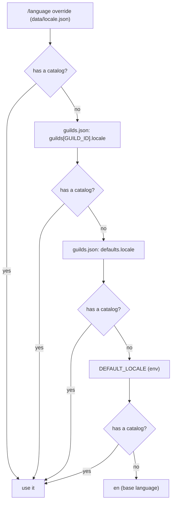

**English** · [Español](es/i18n.md)

# Languages (i18n)

English is the **base language** and the only catalog that defines keys. Mexican Spanish
(`es-MX`) is the second one. Adding a third language is one JSON file — plus one line if you
also want Discord to localize the command metadata.

Nothing here needs a build step and there is no new dependency: the catalogs are plain JSON,
loaded with `readFileSync`.

## Layout

```text
src/i18n/
  core.js             pure rules: keys, interpolation, plurals, fallbacks (no filesystem)
  index.js            loads locales/*.json and exports t(), plural(), has(), localizationsFor()
  commands.js         localizeCommand() / localizeOption() for the slash-command metadata
  discord-locales.js  internal tag -> Discord locale (es-MX -> es-419)
  locales/
    en.json           base catalog: keys are defined here and nowhere else
    es-MX.json        translation; must have exactly the same keys
```

## Using it

```js
import { t, plural, has } from './i18n/index.js';

t(locale, 'embeds.status.running');                       // "🟢 running"
t(locale, 'embeds.control.task', { taskId });             // "Daemon task #42"
plural(locale, 'embeds.confirm.players', players.length); // "<key>_one" / "<key>_other"
has(locale, `commands.${name}.notes`);                    // optional text
```

- Keys are dot paths into the nested JSON (`embeds.servers.title`).
- `{param}` interpolates. **A param you did not pass stays visible** (`{name}`): a typo in a
  catalog should be loud, not silently eat data.
- A key that exists nowhere returns `⟨key⟩` and logs one warning per key, instead of an empty
  message.
- A missing key in a translation falls back to the base language, so a half-translated
  catalog degrades to English instead of breaking.

## Where the language comes from

It is resolved **once per guild** (not per user), so all the messages in one Discord stay in
the same language:



A value with no catalog is **skipped**, never half-served: the next candidate is tried.
Region variants without a file of their own are served by the catalog of their language, so
`es-AR` and Discord's `es-419` both read `es-MX.json`.

`/language` with no arguments tells you the effective language and where it came from
(`/language` override, `config/guilds.json`, `defaults`, `DEFAULT_LOCALE` or the base
language). `locale:auto` deletes the override and goes back to the configured language. See
[commands.md](commands.md#language) and [configuration.md](configuration.md).

## What gets translated

| Translated | Not translated (on purpose) |
|---|---|
| Embeds: titles, field names, footers, colors are shared | Console logs (`docker logs`): they are for the operator, not the player |
| Buttons (`Yes, stop` / `Sí, apagar`) and ephemeral replies | Command **names**: `/start` is `/start` everywhere |
| `/help`, including the option help and the notes | Examples in `/help`: they are command lines |
| Auto-stop warnings and the join/leave feed | Values coming from the panel (server labels, game ids, player names) |

Discord also localizes the **command metadata** (descriptions and option descriptions) with
`setDescriptionLocalizations`. Discord has its own locale list and it has no `es-MX`: Latin
American Spanish is `es-419`, mapped in `discord-locales.js`. Command names are left canonical
on purpose — what you type has to work the same in every guild.

Auto-stop notices are built **per guild**: the watcher passes a factory to `fanOut()`, so each
Discord receives the warning in its own language instead of the first guild's.

## Plurals

Plural text lives in two keys, `<key>_one` and `<key>_other`, and the form is picked with
`Intl.PluralRules` for the requested language:

```json
"players_one": "**{count}** player is online:",
"players_other": "**{count}** players are online:"
```

The lookup tries `<key>_<form>`, then `<key>_other`, then the base language. Languages with
more forms (`few`, `many`, …) work as soon as the keys exist.

## Adding a language

1. Copy `src/i18n/locales/en.json` to `src/i18n/locales/<tag>.json` (for instance `pt-BR.json`)
   and translate the values. **Do not add, remove or rename keys**: `en.json` is the source of
   keys.
2. If Discord should localize the command metadata too, add the tag to
   `src/i18n/discord-locales.js` mapping it to its Discord locale
   (`'pt-BR': 'pt-BR'`). Without that line the language still works for messages and help.
3. `npm test` — the guards fail if a key is missing, if a translation defines keys that do not
   exist in the base, or if the code asks for a key nobody wrote.
4. `npm run deploy` to re-register the commands with the new localizations.
5. Ship the announcement: `/language locale:<tag>` in the guild, or `"locale": "<tag>"` in
   `config/guilds.json`.

## Guards (tests)

`npm test` includes:

- **Catalog parity**: every language translates every key of the base, with no extras.
- **Coverage**: every key the code asks for literally must exist in `en.json`; breaking one
  makes the suite fail.
- **Sentinels**: a list of user-facing phrases that must not come back into the modules.
- **Placeholder balance**: every value has the same number of `{` and `}`, and none is empty.
- **Per-guild behavior**: two guilds, two languages, one notice each

The Spanish documentation is checked too: `npm run check:docs` verifies that
`docs/i18n.md` and `docs/es/i18n.md` (and every other pair) have the same headings and valid
links.
