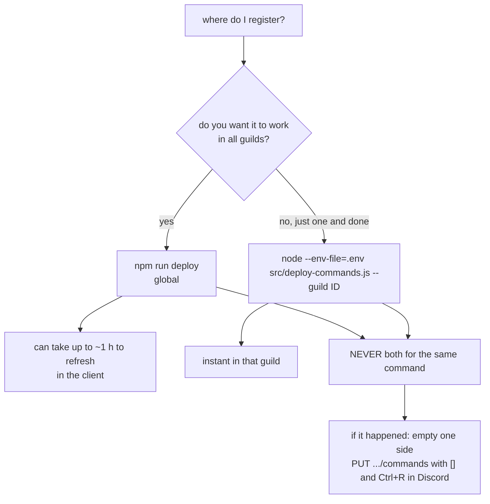

**English** · [Español](es/operations.md)

# Operation

Bot runbook: deploy, update, rotate credentials, and diagnose. Everything runs from
`/opt/gameap-discord-bot` (also visible from Dockge).

## Requirements

| Item | Detail |
|---|---|
| Docker + compose | The bot runs in the `gameap-bot` container (`network_mode: host`) |
| Node 22 on the host | Only for `npm run deploy` and `npm test` (the runtime lives in the image) |
| Panel PAT | With the 6 abilities from [gameap-api.md](gameap-api.md#required-pat-abilities) |
| Discord bot | Own token; View Channel, Send Messages, Embed Links, Read Message History permissions |

## Deployment

```bash
cd /opt/gameap-discord-bot
cp .env.example .env && chmod 600 .env     # and fill in DISCORD_TOKEN + GAMEAP_TOKEN
cp config/servers.example.json config/servers.json    # and edit the real alias/label/ids
cp config/guilds.example.json  config/guilds.json
npm install
npm test                                   # 77 tests, must pass before deploying
npm run deploy                             # registers the GLOBAL commands
docker compose pull && docker compose up -d
docker logs -f gameap-bot                  # "loaded 11 commands" + "logged in as ... — N guild(s)"
```

Details in the `compose.yaml` that are not cosmetic:

- `network_mode: host` — UFW blocks container → host; this way the bot reaches `127.0.0.1:8025`.
- `image:` + a commented `build:` — the image is built and published by the `docker` workflow
  (see [Using the published image](#using-the-published-image)); uncomment the block to build locally
  and keep `build.network: host`, because BuildKit can't resolve DNS on this host (`npm ci` inside
  the build used to fail).
- `user: "1000:1000"` — the same uid as the host user, so `./data` doesn't end up root-owned.
- `logging` with `max-size: 10m` / `max-file: 3` — the log doesn't grow unchecked.

## Updating the code

```bash
cd /opt/gameap-discord-bot
docker compose pull          # pulls the image the CI published from main
docker compose up -d         # recreates the container with the new code
docker logs -f gameap-bot    # "loaded 11 commands"
```

The suite runs in CI before publishing, so there is nothing to test or build on the host. If you are
working on the code locally and don't want to wait for CI, uncomment the `build:` block in
`compose.yaml` and use `docker compose up -d --build`.

If you touched `src/commands/` (name, description, or options), **also**:

```bash
npm run deploy
```

## Using the published image

The `docker` workflow (`.github/workflows/docker.yml`) runs the whole suite and publishes the
image to the GitHub Container Registry:

| Where the build comes from | Tags published |
|---|---|
| push to `main` | `latest`, `sha-<short>` |
| tag `v1.2.3` | `1.2.3`, `1.2`, `latest`, `sha-<short>` |
| pull request | nothing: it only compiles, to validate the Dockerfile |
| manual ("Run workflow") | the same tags as the ref it runs on |

`compose.yaml` already uses that image; the rest of the service is unchanged (`env_file`, the `./data`
and `./config` mounts, `network_mode: host`):

```yaml
services:
  gameap-bot:
    image: ghcr.io/neyzerth/gameap-discord:latest
    # build:            # uncomment to build locally instead of pulling
    #   context: .
    #   network: host
```

Then `docker compose pull && docker compose up -d`. Pin a version (`:1.2.3`) if you would rather
not follow `latest`.

The image ships **only** `config/*.example.json`: `.dockerignore` keeps `.env`,
`config/servers.json` and `config/guilds.json` out of the build context, so an image pulled by
anyone carries no ids and no tokens. That is also why a container started from the image needs
your config mounted (or `SERVERS_FILE`/`GUILDS_FILE` pointing at it) and `.env` passed with
`env_file`. The package starts private: adjust its visibility in the package settings on GitHub
if you want it public — and if it stays private, `docker login ghcr.io` on the host first.

## Command registration: a single source



Clearing the per-guild registration of a server (requires the bot token):

```bash
curl -X PUT "https://discord.com/api/v10/applications/<APP_ID>/guilds/<GUILD_ID>/commands" \
  -H "Authorization: Bot ***" -H 'Content-Type: application/json' -d '[]'
```

Globals are changed with `npm run deploy`. If the client shows old or duplicated commands,
`Ctrl+R` in Discord clears the local cache.

## Credentials

| Secret | Where | Rotation |
|---|---|---|
| `DISCORD_TOKEN` | `.env` (chmod 600) | Developer Portal → Bot → Reset Token → update `.env` → `docker compose up -d` |
| `GAMEAP_TOKEN` (PAT) | `.env` | Panel → Profile → API tokens → create a new one with the same abilities, put it in `.env`, recreate the container, and revoke the old one |

Rules: `.env` never goes into the repo (it's already in `.gitignore`), logs never print tokens,
and the panel PAT must be created with **only** the 6 required abilities.

## Adding a new Discord guild

1. Invite the bot with the portal link:
   `https://discord.com/oauth2/authorize?client_id=<APP_ID>&scope=bot%20applications.commands&permissions=84992`
   (permissions: View Channel 1024 + Send Messages 2048 + Embed Links 16384 + Read Message History 65536).
2. Read the logs: on entry, the bot prints `joined guild <name> (<id>) — text channels: #channel(<id>) …`.
3. Add the entry in `config/guilds.json` (optional: without an entry it works with the defaults, but
   without a feed):

```json
"<GUILD_ID>": { "feedChannelId": "<CHANNEL_ID>", "servers": ["8"], "operatorRoleIds": [] }
```

4. `docker compose restart gameap-bot` and check for `— 2 guild(s)` in the log.
5. Real test: inject a fake player in `data/state.json` and restart (see
   [development.md](development.md#testing-the-feed-without-real-players)).

## Adding a game server

1. In `config/servers.json`, add the panel id with `alias`, `label`, `emoji`, and `announce`:

```json
"11": { "alias": "valheim", "label": "Valheim", "emoji": "🪓", "announce": true }
```

2. `docker compose restart gameap-bot` (config is cached at startup).
3. Check `/servers` and, if you want a feed, `/feed valheim on` in the channel.
4. If the game doesn't support listing players, the watcher detects it and leaves it out of the
   feed with a warning in the logs (once only).

## Logs and diagnostics

```bash
docker logs --tail 50 gameap-bot          # normal: loaded N commands, logged in, baselines
docker logs -f gameap-bot | grep -i warn  # panel/RCON/channel issues
docker inspect gameap-bot --format 'restarts={{.RestartCount}} status={{.State.Status}}'
docker stats --no-stream gameap-bot       # footprint: ~30 MB RAM, CPU almost 0
```

For more detail, set `LOG_LEVEL=debug` in `.env` and recreate: you'll see the cycles with the
server off (`server 8 is offline; skipping poll`).

| Symptom | Likely cause | Fix |
|---|---|---|
| `DISCORD_TOKEN is required` / `GAMEAP_TOKEN is required` | `.env` missing the variable (or a bad env_file) | Fill `.env`, `docker compose up -d` |
| `Command failed` on all commands | PAT without abilities, or panel down | `curl /api/servers` with the PAT; check abilities |
| Commands don't show up in Discord | Global registration hasn't propagated | `Ctrl+R`; `/help` in a channel; verify `npm run deploy` |
| Duplicated commands appear | Global + per-guild registration, or app with *user install* | Clear the per-guild set (above) and disable user install in the portal; `Ctrl+R` |
| The feed never publishes | No `announce: true`, no `feedTarget()`, or `unsupported` | `docker logs` (look for `baseline server`), `/feed <server> on` |
| `could not announce to <id>` | Bot lacks permissions in that channel | Grant View Channel + Send Messages + Embed Links |
| Container restarts in a loop | Invalid token or quotes in `.env` | `docker logs --tail 20` (the login error shows up) |
| The server shuts itself down | Auto-stop by inactivity (`/autostop`) | `/autostop <server>` and the feed channel: the earlier notice explains why |
| `/autostop` doesn't stop anything | `hours: 0`, or the clock keeps resetting on failed polls | `/autostop <server>` (look at `Idle now`), `LOG_LEVEL=debug` |
| `AUTOSTOP_DRY_RUN=true` and it doesn't apply | Container variables are set when the container is created | `docker compose up -d --force-recreate` and `docker exec gameap-bot printenv AUTOSTOP_DRY_RUN` |
| `/start` starts nothing and the embed stays "Starting…" | **Old systemd socket FIFO** (see below) or another Minecraft running (host limit) | `/srv/gameap/fix-gameap-server-start.sh --check <uuid>`; check the console in the panel |

### `/start` always fails and the panel won't start it either: orphaned FIFO

Symptom in the panel/API: the `gsstart` task exits `success` but the server doesn't start (or the
panel returns an error). In the journal:

```
gameap-server-<uuid>.socket: Failed to open FIFO /srv/gameap/.systemd-services/<uuid>.stdin: File exists
gameap-server-<uuid>.socket: Failed with result 'resources'.
gameap-server-<uuid>.service: Start request repeated too quickly / Failed with result 'start-limit-hit'
```

**Exact** cause (read in systemd 255's `src/core/socket.c`, `fifo_address_create`): when binding a
`ListenFIFO`, systemd accepts an already-existing FIFO **only if** it is a FIFO, its mode is exactly
`SocketMode & ~umask` **using the systemd process's umask** and the uid/gid are systemd's. If not,
it returns `-EEXIST` → *"Failed to open FIFO …: File exists"*. On this host PID1's umask is
**0000** (`/proc/1/status`), so the required mode is **0666**; any FIFO at 0664/0644/0600
fails. Consequence: the socket is `failed`; the service starts **without a socket** (`Got no
socket` in the journal), exits immediately and, with `Restart=always`, falls into
`start-limit-hit`. The panel's `gsstart` task still exits `success`, so the error may only
show up minutes after the attempt.

> **Beware of `UMask=` in the `.socket` unit**: systemd applies the unit's umask when creating the
> node, but compares against the process umask. Setting `UMask=0002` makes systemd create the FIFO
> at 0664 and reject it afterwards. This stack's docs carried `UMask=0002` for a while: it was
> wrong and only traded one EEXIST for another. The correct setting is `UMask=0000` (what's
> created and what's required match at 0666).

Fix (once per server, with sudo):

```bash
sudo /srv/gameap/fix-gameap-server-start.sh <uuid>     # deletes the FIFO, resets units, installs a drop-in
# then /start from the panel or Discord
```

The script installs a drop-in `…<uuid>.socket.d/override.conf` with **`UMask=0000`**, an
`ExecStartPre` that removes leftovers and pre-creates the FIFO at 0666 (`rm -f …; mkfifo -m 0666 …;
chmod 0666 …`) and `RemoveOnStop=true`. Drop-ins survive the daemon rewriting the unit at every
boot. The GameAP daemon does **not** create FIFOs (there's no `mkfifo` in its code), so nobody
competes for the file.

**Plan B** if the FIFO keeps fighting: `sudo /srv/gameap/fix-gameap-server-start.sh --no-socket
<uuid>` removes the socket dependency on the `.service` (empty `Sockets=` + `StandardInput=null`).
The server always starts; you lose **sending** commands through the panel console (reading the log
still works and RCON is untouched).

The uuids: `ls /etc/systemd/system | grep 'gameap-server-.*\\.socket$'`.

## Backups

What's worth backing up: `config/` (catalog and guilds) and, optionally, `data/` (feed state and
`/language` overrides). `.env` goes separately, encrypted, because it holds the secrets.

```bash
tar czf /var/backups/gameap-bot-config-$(date +%F).tar.gz -C /opt/gameap-discord-bot config .env
```

`data/state.json`, `data/feeds.json` and `data/locale.json` are disposable: they get recreated,
and deleting them only costs a quiet baseline (state) or the runtime overrides (`/feed`,
`/language`). `data/locale.json` in particular is safe to delete: every guild falls back to its
configured locale (`guilds.json` → `DEFAULT_LOCALE` → `en`).

## Checklist after any change

- [ ] `npm test` green (77 tests)
- [ ] `docker logs --tail 10` without `ERROR`, with `loaded 11 commands` and `— N guild(s)`
- [ ] `docker inspect ... RestartCount` at 0
- [ ] A real command tested (`/servers` and `/players <server>`)
- [ ] If you touched the feed: inject a fake player and see the notice in the right channel