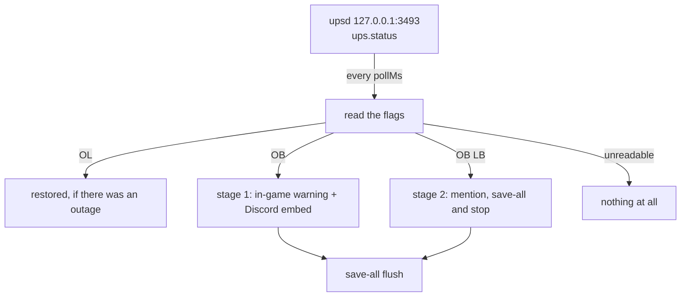

**English** · [Español](es/power.md)

# Power outages (UPS via NUT)

When the mains fail, the bot can warn the players in game and in Discord **before** the host runs
out of battery and shuts down. It reads the UPS directly — no GameAP, no extra service: `upsd`
answers read-only variable queries on `127.0.0.1:3493` and asks for no credentials.

> **Optional feature.** With no `config/power.json` (or `enabled: false`) the loop never starts:
> no socket, no timer, no log noise. Nothing else in the bot changes.

## How it works

A timer of its own (10 s by default) reads `ups.status` from NUT and looks at its flags: `OL` (on
line), `OB` (on battery), `LB` (low battery). Anything else — `RB`, `CAL`, a timeout, a reply that
cannot be parsed — means **silence**: a failed read is never an outage.

It is a separate timer and not a step of the player watcher on purpose: the watcher cycle can spend
seconds talking to the panel, and the low-battery window is short (the host starts its shutdown a
couple of minutes after `LB`).



Two stages instead of one, on purpose: a single "the server will shut down in the next minutes"
line would be a lie on a 30-second flicker, where the host does not shut down at all.

## Exact rules

| Situation | What the bot does |
|---|---|
| `OB` for the first time in an episode | In-game warning (title + chat + `save-all flush`) and the Discord embed, no mention |
| `LB` for the first time in an episode | In-game warning, the Discord embed **with the configured mention** and the low-battery shutdown |
| `LB` as the very first reading | Both stages, in order |
| Mains back after an episode | "Mains power is back" with the real duration and whether the server was stopped |
| `OL` with no prior outage | Nothing |
| Read failed (timeout, `ERR`, unknown flags) | Nothing: the stored state is left untouched |
| Bot restarted in the middle of an outage | The outage is not announced twice; the recovery still is |

Every stage is announced **once per episode**, and the episode closes when `OL` comes back.

## Configuration

### By file

`config/power.json` (gitignored; the repo ships [`config/power.example.json`](../config/power.example.json)):

```json
{
  "enabled": true,
  "nut": { "host": "127.0.0.1", "port": 3493, "ups": "myups", "timeoutMs": 3000 },
  "pollMs": 10000,
  "servers": ["1"],
  "channels": { "123456789012345678": "234567890123456789" },
  "notifyEveryoneOnLowBattery": true,
  "lowBatteryMention": "@everyone",
  "stopServersOnLowBattery": true,
  "stopDelayMs": 5000
}
```

| Key | Default | What it does |
|---|---|---|
| `enabled` | `false` | The feature only starts when this is `true` |
| `nut.ups` | — | The UPS name exactly as it is configured in NUT (required) |
| `nut.host` / `nut.port` | `127.0.0.1` / `3493` | Where `upsd` listens |
| `nut.timeoutMs` | `3000` | Read timeout, 500-15000 |
| `pollMs` | `10000` | How often the status is read, 2000-60000 |
| `servers` | — | Panel ids to warn in game and to stop (required) |
| `channels` | `{}` | `guild id → channel id`; a guild with no entry uses its feed channel |
| `notifyEveryoneOnLowBattery` | `true` | Adds the mention to the stage-2 embed |
| `lowBatteryMention` | `"@everyone"` | The mention itself (a role mention works too) |
| `stopServersOnLowBattery` | `true` | Sends the panel `stop` in stage 2 |
| `stopDelayMs` | `5000` | Pause between the warning and that `stop`, 0-30000 |

Without `nut.ups` or `servers` the file is ignored, and the log says why.

### Low-battery shutdown

In stage 2 the bot warns the players, waits `stopDelayMs` and sends `POST /api/servers/{id}/stop`
for every listed server that is running, so the world is saved and the panel shows **stopped**
instead of the process dying with the host. The server is **not** started again automatically: after
the outage somebody has to run `/start <server>`.

### Safe mode (`POWER_DRY_RUN`)

```bash
echo 'POWER_DRY_RUN=true' >> .env && docker compose up -d --force-recreate   # logs and embeds, sends nothing
echo 'POWER_DRY_RUN=false' >> .env && docker compose up -d --force-recreate  # back to normal
```

`docker restart` is not enough: environment variables are fixed when the container is created. The
embeds carry the footer *DRY RUN — nothing was sent to the game and nothing was stopped*, and the
log shows the exact RCON lines that would go out.

## What it announces

### In game (RCON)

Through the panel (`POST /api/servers/{id}/rcon`), so no game port is opened and the daemon speaks
the RCON. Stage 1 sends a `title`, a `tellraw` and `save-all flush`; stage 2 repeats them without
the big title. The text lives in the i18n catalog (per guild) and **carries no emoji**: there is a
test that fails if one shows up.

### In Discord

| Stage | Title | Extra |
|---|---|---|
| 1 | ⚡ Mains power lost | Battery `%` and runtime as fields |
| 2 | 🔋 Low battery — shutdown imminent | The configured mention |
| Back | ✅ Mains power is back | Duration, and how to start the server again if it was stopped |

## State in `data/state.json`

```json
"power": {
  "status": "low", "obSince": 1759170000000, "stage1At": 1759170000000,
  "stage2At": 1759170600000, "stoppedAt": 1759170605000,
  "charge": "87", "runtime": "2h 05m"
}
```

- `obSince`: when the mains were lost (the recovery message measures the outage from here).
- `stage1At` / `stage2At`: the markers that stop the same warning from repeating every 10 s.
- `stoppedAt`: this outage ended with the bot stopping the server.

Deleting `power` is safe: the next read starts a fresh episode.

## Common problems

| Symptom | Likely cause | What to check |
|---|---|---|
| Nothing is ever announced | `enabled: false`, missing file, or empty `servers` | `docker logs gameap-bot \| grep -i power` |
| The log says `NUT read failed` | No reachable `upsd`, wrong port, or a firewall | `printf 'GET VAR myups ups.status\n' \| nc 127.0.0.1 3493` |
| No in-game warning | The server is stopped, so the RCON is skipped | `/status <server>` |
| The Discord notice never shows up | No channel for that guild, or the guild cannot use the server | `docker logs \| grep "power notice"` |
| The mention does not ping | The bot lacks **Mention Everyone** in that channel | Channel permissions → the bot's role |
| The server stopped and nobody said why | That is stage 2 working | `data/state.json` → `stoppedAt` |

## How to test it without risk

1. **Dry run**: `POWER_DRY_RUN=true` and `docker compose up -d --force-recreate`. Everything is
   logged and the embed is posted, nothing is sent to the game and no server is stopped.
2. **Fake UPS**: point `nut.port` at a tiny TCP server that answers `LIST VAR` with
   `ups.status "OB"`, and watch the three stages against the real server. This covers the whole
   chain without touching the UPS.
3. **The real thing**: unplug the UPS from the wall for 3 minutes with the server on. Stage 1 must
   show up within one poll, and plugging it back must post the recovery with the duration. Three
   minutes never reach `LB`, so nothing is stopped.
